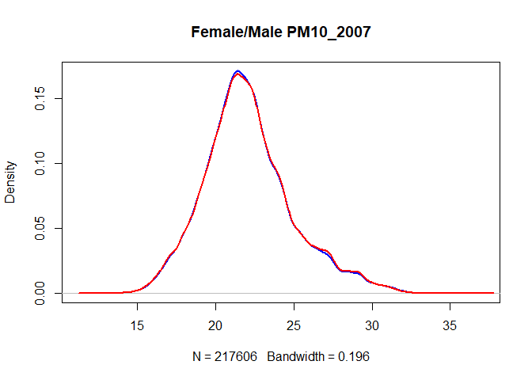
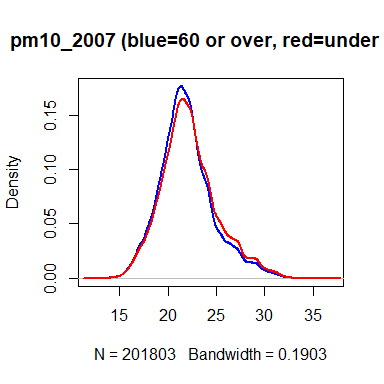
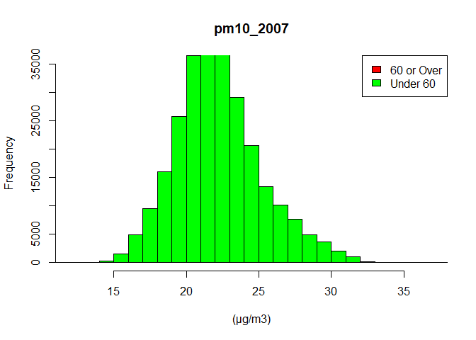
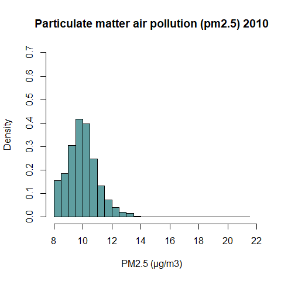
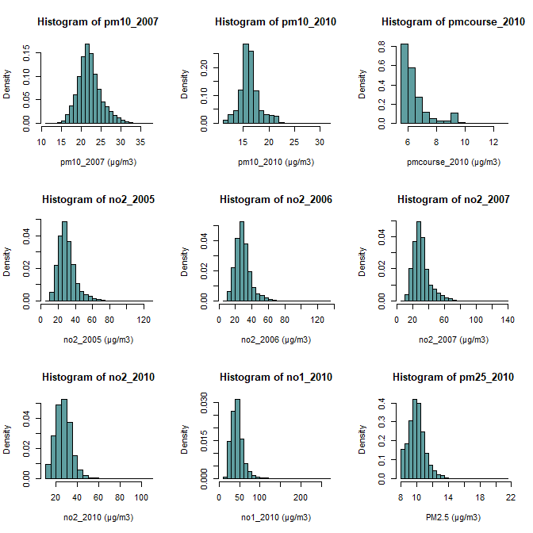
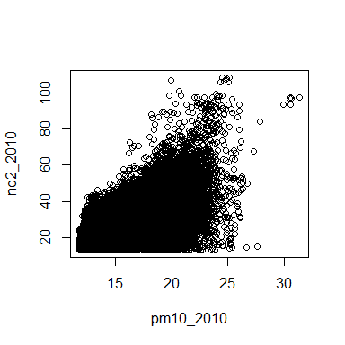
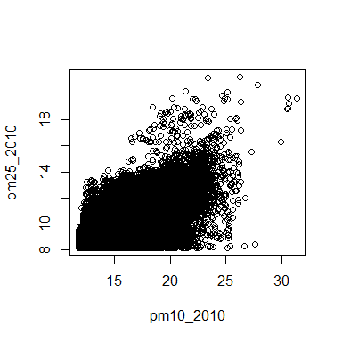
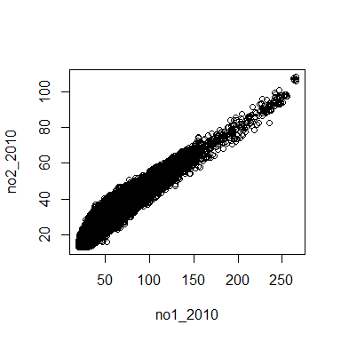
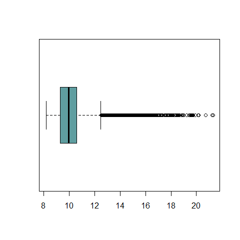
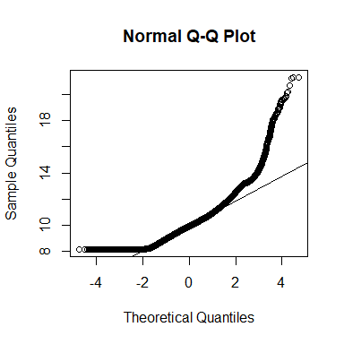

Air Pollution and Health Outcomes in the UK Biobank
================
Caitlyn Chitwood
January 04, 2023

- <a href="#descriptive-statistics"
  id="toc-descriptive-statistics">Descriptive Statistics</a>
  - <a href="#summary-statistics" id="toc-summary-statistics">Summary
    Statistics</a>
  - <a href="#density-plots" id="toc-density-plots">Density Plots</a>
  - <a href="#histograms" id="toc-histograms">Histograms</a>
  - <a href="#scatter-plots-and-correlation-coefficients-pollutants"
    id="toc-scatter-plots-and-correlation-coefficients-pollutants">Scatter
    Plots and Correlation Coefficients: pollutants</a>
  - <a
    href="#scatter-plots-and-correlation-coefficients-pollutants-and-covariates"
    id="toc-scatter-plots-and-correlation-coefficients-pollutants-and-covariates">Scatter
    Plots and Correlation Coefficients: pollutants and covariates</a>
  - <a href="#pm-25" id="toc-pm-25">PM 2.5</a>
    - <a href="#box-plot" id="toc-box-plot">Box Plot</a>
    - <a href="#qq-plot" id="toc-qq-plot">QQ Plot</a>
    - <a href="#outliers" id="toc-outliers">Outliers</a>
    - <a
      href="#correlation-coefficients-pollutant-extreme-outliers-and-covariates"
      id="toc-correlation-coefficients-pollutant-extreme-outliers-and-covariates">Correlation
      Coefficients: pollutant extreme outliers and covariates</a>
    - <a
      href="#correlation-coefficients-pollutant-mild-outliers-and-covariates"
      id="toc-correlation-coefficients-pollutant-mild-outliers-and-covariates">Correlation
      Coefficients: pollutant mild outliers and covariates</a>
- <a href="#regression-cox-proportional-hazards-model"
  id="toc-regression-cox-proportional-hazards-model">Regression: Cox
  Proportional-Hazards Model</a>
  - <a href="#model-1-age-and-sex-covariates-only"
    id="toc-model-1-age-and-sex-covariates-only">Model 1: age and sex
    covariates only</a>
  - <a href="#model-2-multiple-covariates"
    id="toc-model-2-multiple-covariates">Model 2: multiple covariates</a>
- <a href="#citations" id="toc-citations">Citations</a>

Lung cancer data was used for the following analyses.

## Descriptive Statistics

### Summary Statistics

``` r
kable(head(df_pheno),
      caption = "A table showing first 6 rows of relevant variables.",
      )
```

|     eid |  townsend |     bmi | householdIncomeCat   | dateAssesment | pm10_2007 | pm10_2010 | pm25Absorb_2010 | pm25_2010 | pmcourse_2010 | no2_2005 | no2_2006 | no2_2007 | no2_2010 | no1_2010 | fuel                                                                      | education                                                                                                                                             | exposeSmokeHomeRaw | timeCurrentAddress | dateLostFollowUp | dateCensor | dateCutoff | date_of_death | ageBaseline | race  | sex    | packYear | smokingCat                    | pm10_2007per10 | pm10_2010per10 | pm25_2010per5 | pmcourse_2010per5 | no2_2005per10 | no2_2006per10 | no2_2007per10 | no2_2010per10 | no1_2010per20 | baselineDate | dob        | cancerDate | cancerICD10 | cancerHistology | cancerBehaviour         | meaning                              | ICD10group | prior_cancer | lung_cancer | t_lungCancer | cancerDate_Lung |
|--------:|----------:|--------:|:---------------------|:--------------|----------:|----------:|----------------:|----------:|--------------:|---------:|---------:|---------:|---------:|---------:|:--------------------------------------------------------------------------|:------------------------------------------------------------------------------------------------------------------------------------------------------|:-------------------|:-------------------|:-----------------|:-----------|:-----------|:--------------|------------:|:------|:-------|---------:|:------------------------------|---------------:|---------------:|--------------:|------------------:|--------------:|--------------:|--------------:|--------------:|--------------:|:-------------|:-----------|:-----------|:------------|----------------:|:------------------------|:-------------------------------------|:-----------|-------------:|------------:|-------------:|:----------------|
| 1000018 | -4.517900 | 24.1274 | 31,000 to 51,999     | 2009-05-23    |     24.13 |     15.98 |            1.15 |     10.32 |          6.00 |    29.48 |    29.65 |    30.31 |    29.92 |    46.81 | A gas hob or gas cooker                                                   | O levels/GCSEs or equivalent\|NVQ or HND or HNC or equivalent                                                                                         | 0                  | 4                  | NA               | 2020-02-29 | 2020-02-29 | NA            |    43.51814 | White | Male   |       NA | Past smoker unknown pack year |          2.413 |          1.598 |         2.064 |             1.200 |         2.948 |         2.965 |         3.031 |         2.992 |        2.3405 | 5/23/2009    | 11/15/1965 | 7/23/2015  | C822        |            9698 | Malignant, primary site | C82.2 Large cell, follicular         | NA         |            0 |           0 |           NA | NA              |
| 1000020 | -3.607660 | 28.9216 | 31,000 to 51,999     | 2007-08-03    |     21.08 |     17.15 |            1.00 |      9.37 |          6.70 |    20.61 |    19.94 |    21.93 |    17.50 |    33.00 | None of the above                                                         | CSEs or equivalent                                                                                                                                    | 0                  | 27                 | NA               | 2020-02-29 | 2020-02-29 | NA            |    57.13347 | White | Female |     0.00 | Never smoker                  |          2.108 |          1.715 |         1.874 |             1.340 |         2.061 |         1.994 |         2.193 |         1.750 |        1.6500 | NA           | NA         | NA         | NA          |              NA | NA                      | NA                                   | NA         |            0 |           0 |           NA | NA              |
| 1000037 | -1.198350 | 32.7558 | Prefer not to answer | 2009-11-05    |     25.50 |     14.04 |            0.89 |      9.54 |          5.61 |    19.12 |    18.02 |    20.65 |    19.66 |    38.84 | A gas hob or gas cooker                                                   | O levels/GCSEs or equivalent                                                                                                                          | 45                 | 21                 | NA               | 2020-02-29 | 2020-02-29 | NA            |    60.05749 | White | Female |    76.00 | Past smoker \>19 pack year    |          2.550 |          1.404 |         1.908 |             1.122 |         1.912 |         1.802 |         2.065 |         1.966 |        1.9420 | 11/5/2009    | 10/15/1949 | 10/22/2013 | C504        |            8500 | Malignant, primary site | C50.4 Upper-outer quadrant of breast | C50        |            0 |           0 |           NA | NA              |
| 1000043 |  4.682530 | 26.7563 | 52,000 to 100,000    | 2007-05-12    |     26.95 |     16.66 |            1.43 |     10.38 |          6.24 |    50.80 |    48.50 |    53.12 |    34.31 |    51.70 | None of the above                                                         | College or University degree                                                                                                                          | 0                  | 7                  | NA               | 2020-02-29 | 2020-02-29 | NA            |    60.82409 | White | Male   |       NA | Past smoker unknown pack year |          2.695 |          1.666 |         2.076 |             1.248 |         5.080 |         4.850 |         5.312 |         3.431 |        2.5850 | NA           | NA         | NA         | NA          |              NA | NA                      | NA                                   | NA         |            0 |           0 |           NA | NA              |
| 1000051 | -1.003240 | 28.3711 | Prefer not to answer | 2008-01-11    |     20.03 |     17.23 |            1.36 |     10.58 |          6.49 |    26.38 |    25.73 |    26.38 |    33.02 |    52.70 | A gas hob or gas cooker\|A gas fire that you use regularly in winter time | College or University degree\|A levels/AS levels or equivalent\|O levels/GCSEs or equivalent\|Other professional qualifications eg: nursing, teaching | 0                  | 43                 | NA               | 2020-02-29 | 2020-02-29 | 2015-10-19    |    67.73990 | White | Male   |     5.20 | Past smoker 1-19 pack year    |          2.003 |          1.723 |         2.116 |             1.298 |         2.638 |         2.573 |         2.638 |         3.302 |        2.6350 | 1/11/2008    | 4/15/1940  | 9/10/2015  | C930        |            9891 | Malignant, primary site | C93.0 Acute monocytic leukaemia      | NA         |            0 |           0 |           NA | NA              |
| 1000066 | -0.541713 | 42.4953 | 18,000 to 30,999     | 2007-05-08    |     22.85 |     14.56 |            0.98 |      9.84 |          5.84 |    25.57 |    23.88 |    26.49 |    23.43 |    31.54 | A gas hob or gas cooker                                                   | O levels/GCSEs or equivalent\|CSEs or equivalent\|NVQ or HND or HNC or equivalent                                                                     | NA                 | 10                 | NA               | 2020-02-29 | 2020-02-29 | NA            |    42.89391 | White | Female |    18.75 | Current smoker 1-19 pack year |          2.285 |          1.456 |         1.968 |             1.168 |         2.557 |         2.388 |         2.649 |         2.343 |        1.5770 | NA           | NA         | NA         | NA          |              NA | NA                      | NA                                   | NA         |            0 |           0 |           NA | NA              |

A table showing first 6 rows of relevant variables.

There are 4081 cases of lung cancer in the data set.

### Density Plots

``` r
kd_male <- density(na.omit(pm10_2007[sex=="Male"])) #define kernel density
plot(kd_male,
     col='blue',
     lwd=2,
     main = "Female/Male PM10_2007") #create kernel density plot
kd_female <- density(na.omit(pm10_2007[sex=="Female"]))
lines(kd_female,
      col='red',
      lwd=2)
```

<!-- -->

``` r
# fill in kernel density plot with specific color
# polygon(kd_male, col='blue', border='black')
# polygon(kd_female, col='red', border='black')
```

``` r
x1 = na.omit(pm10_2007[ageBaseline>=60])
x2 = na.omit(pm10_2007[ageBaseline<60])
plot_mult_density("pm10_2007 (blue=60 or over, red=under 60)", x1,x2)
```

<!-- -->

### Histograms

``` r
#define data
x1 = na.omit(pm10_2007[ageBaseline>=60])
x2 = na.omit(pm10_2007[ageBaseline<60])

#plot two histograms in same graph
hist(x1, col='red', main='pm10_2007', xlab='(μg/m3)')
hist(x2, col='green', add=TRUE)

#add legend
legend('topright', c('60 or Over', 'Under 60'), fill=c('red', 'green'))
```

<!-- -->

``` r
hist(pm25_2010, 
     main="Particulate matter air pollution (pm2.5) 2010",
     xlab="PM2.5 (μg/m3)",
     col="cadetblue",
     freq=FALSE,
     ylim=c(0,0.7))

#Plot lognormal distribution
xfit <- seq(min(pm25_2010, na.rm = TRUE),
            max(pm25_2010, na.rm = TRUE),
            length = 40)
yfit <- dlnorm(xfit,
               meanlog = log(mean(pm25_2010)),
               sdlog = log(sd(pm25_2010)))
lines(xfit, yfit, col = "black", lwd = 2)
```

<!-- -->

The distribution is right-skewed and appears to be a log normal
distribution.

``` r
par(mfrow=c(3,3))
hist(pm10_2007, 
     xlab="pm10_2007 (μg/m3)",
     col="cadetblue",
     freq=FALSE)

hist(pm10_2010, 
     xlab="pm10_2010 (μg/m3)",
     col="cadetblue",
     freq=FALSE)

hist(pmcourse_2010, 
     xlab="pmcourse_2010 (μg/m3)",
     col="cadetblue",
     freq=FALSE)

hist(no2_2005, 
     xlab="no2_2005 (μg/m3)",
     col="cadetblue",
     freq=FALSE)

hist(no2_2006, 
     xlab="no2_2006 (μg/m3)",
     col="cadetblue",
     freq=FALSE)

hist(no2_2007, 
     xlab="no2_2007 (μg/m3)",
     col="cadetblue",
     freq=FALSE)

hist(no2_2010, 
     xlab="no2_2010 (μg/m3)",
     col="cadetblue",
     freq=FALSE)

hist(no1_2010, 
     xlab="no1_2010 (μg/m3)",
     col="cadetblue",
     freq=FALSE)

hist(pm25_2010, 
     xlab="PM2.5 (μg/m3)",
     col="cadetblue",
     freq=FALSE)
```

<!-- -->

### Scatter Plots and Correlation Coefficients: pollutants

``` r
plot(pm10_2010, no2_2010)
```

<!-- -->

``` r
cor(pm10_2010, no2_2010, method="pearson", use="complete.obs")
```

    ## [1] 0.5055037

``` r
cor(pm10_2010, no2_2010, method="spearman", use="complete.obs")
```

    ## [1] 0.5398056

``` r
plot(pm10_2010,pm25_2010)
```

<!-- -->

``` r
cor(pm10_2010, pm25_2010, method="pearson", use="complete.obs")
```

    ## [1] 0.5325037

``` r
cor(pm10_2010, pm25_2010, method="spearman", use="complete.obs")
```

    ## [1] 0.5687892

``` r
plot(no1_2010, no2_2010)
```

<!-- -->

``` r
cor(no1_2010, no2_2010, method="pearson", use="complete.obs")
```

    ## [1] 0.9219059

``` r
cor(no1_2010, no2_2010, method="spearman", use="complete.obs")
```

    ## [1] 0.9144932

### Scatter Plots and Correlation Coefficients: pollutants and covariates

``` r
cor(pm25_2010, ageBaseline, use="pairwise.complete.obs")
```

    ## [1] -0.07250032

``` r
cor(pm25_2010, bmi, use="pairwise.complete.obs")
```

    ## [1] 0.04181106

``` r
cor(pm25_2010, packYear, use="pairwise.complete.obs")
```

    ## [1] 0.07892377

### PM 2.5

#### Box Plot

``` r
quantile(pm25_2010, na.rm=TRUE)
```

    ##    0%   25%   50%   75%  100% 
    ##  8.17  9.29  9.94 10.57 21.31

``` r
iqr <- IQR(pm25_2010, na.rm=TRUE)

boxplot(pm25_2010, 
        horizontal=TRUE,
        col="cadetblue")
```

<!-- -->

#### QQ Plot

``` r
qqnorm(pm25_2010)
qqline(pm25_2010)
```

<!-- -->

#### Outliers

``` r
extremeOut <- 3*iqr
mildOut <- 1.5*iqr

extremePM25 <- subset(df_pheno, pm25_2010 > (mean(pm25_2010, na.rm=TRUE)+ extremeOut))
mildPM25 <- subset(df_pheno, pm25_2010 > (mean(pm25_2010, na.rm=TRUE)+ mildOut))
```

There are 958 extreme outliers and 20992 mild outliers for PM2.5 data
from 2010.

#### Correlation Coefficients: pollutant extreme outliers and covariates

``` r
cor(extremePM25$pm25_2010, extremePM25$ageBaseline)
```

    ## [1] 0.04268743

``` r
cor(extremePM25$pm25_2010, extremePM25$bmi, use="pairwise.complete.obs")
```

    ## [1] 0.0300583

``` r
cor(extremePM25$pm25_2010, extremePM25$packYear, use="pairwise.complete.obs")
```

    ## [1] -0.01779504

#### Correlation Coefficients: pollutant mild outliers and covariates

``` r
cor(mildPM25$pm25_2010, mildPM25$ageBaseline, use="pairwise.complete.obs")
```

    ## [1] 0.003296757

``` r
cor(mildPM25$pm25_2010, mildPM25$bmi, use="pairwise.complete.obs")
```

    ## [1] -0.004101232

``` r
cor(mildPM25$pm25_2010, mildPM25$packYear, use="pairwise.complete.obs")
```

    ## [1] 0.009053578

``` r
rm(mildPM25, extremePM25)
```

## Regression: Cox Proportional-Hazards Model

### Model 1: age and sex covariates only

``` r
res.model1 <- coxph(
  Surv(t_lungCancer, lung_cancer) ~  pm25_2010per5 + ageBaseline + sex,
  data = df_pheno,
  ties = "efron"
)
res.model1
```

    ## Call:
    ## coxph(formula = Surv(t_lungCancer, lung_cancer) ~ pm25_2010per5 + 
    ##     ageBaseline + sex, data = df_pheno, ties = "efron")
    ## 
    ##                    coef exp(coef)  se(coef)      z       p
    ## pm25_2010per5 -0.117509  0.889132  0.075179 -1.563 0.11804
    ## ageBaseline    0.008948  1.008988  0.002856  3.133 0.00173
    ## sexMale        0.049517  1.050763  0.032661  1.516 0.12950
    ## 
    ## Likelihood ratio test=15.82  on 3 df, p=0.001232
    ## n= 3764, number of events= 3764 
    ##    (478018 observations deleted due to missingness)

### Model 2: multiple covariates

``` r
res.model2 <- coxph(
  Surv(t_lungCancer, lung_cancer) ~ pm25_2010per5 + ageBaseline + sex + householdIncomeCat + education + bmi + smokingCat +  exposeSmokeHomeRaw,
  data = df_pheno,
  ties = "efron"
)
res.model2
```

    ## Call:
    ## coxph(formula = Surv(t_lungCancer, lung_cancer) ~ pm25_2010per5 + 
    ##     ageBaseline + sex + householdIncomeCat + education + bmi + 
    ##     smokingCat + exposeSmokeHomeRaw, data = df_pheno, ties = "efron")
    ## 
    ##                                                                                                                                                                                                  coef
    ## pm25_2010per5                                                                                                                                                                               -0.084814
    ## ageBaseline                                                                                                                                                                                  0.010640
    ## sexMale                                                                                                                                                                                      0.018504
    ## householdIncomeCat31,000 to 51,999                                                                                                                                                           0.128710
    ## householdIncomeCat52,000 to 100,000                                                                                                                                                         -0.011711
    ## householdIncomeCatDo not know                                                                                                                                                                0.035798
    ## householdIncomeCatGreater than 100,000                                                                                                                                                       0.070560
    ## householdIncomeCatLess than 18,000                                                                                                                                                          -0.014255
    ## householdIncomeCatPrefer not to answer                                                                                                                                                      -0.018698
    ## educationA levels/AS levels or equivalent|CSEs or equivalent                                                                                                                                -0.325472
    ## educationA levels/AS levels or equivalent|NVQ or HND or HNC or equivalent                                                                                                                    0.062123
    ## educationA levels/AS levels or equivalent|NVQ or HND or HNC or equivalent|Other professional qualifications eg: nursing, teaching                                                            2.580298
    ## educationA levels/AS levels or equivalent|O levels/GCSEs or equivalent                                                                                                                      -0.302004
    ## educationA levels/AS levels or equivalent|O levels/GCSEs or equivalent|CSEs or equivalent                                                                                                    0.266440
    ## educationA levels/AS levels or equivalent|O levels/GCSEs or equivalent|CSEs or equivalent|NVQ or HND or HNC or equivalent                                                                    0.784533
    ## educationA levels/AS levels or equivalent|O levels/GCSEs or equivalent|CSEs or equivalent|NVQ or HND or HNC or equivalent|Other professional qualifications eg: nursing, teaching            0.987456
    ## educationA levels/AS levels or equivalent|O levels/GCSEs or equivalent|CSEs or equivalent|Other professional qualifications eg: nursing, teaching                                            0.287766
    ## educationA levels/AS levels or equivalent|O levels/GCSEs or equivalent|NVQ or HND or HNC or equivalent                                                                                      -0.206814
    ## educationA levels/AS levels or equivalent|O levels/GCSEs or equivalent|NVQ or HND or HNC or equivalent|Other professional qualifications eg: nursing, teaching                               1.011529
    ## educationA levels/AS levels or equivalent|O levels/GCSEs or equivalent|Other professional qualifications eg: nursing, teaching                                                              -0.238196
    ## educationA levels/AS levels or equivalent|Other professional qualifications eg: nursing, teaching                                                                                            0.023601
    ## educationCollege or University degree                                                                                                                                                       -0.083532
    ## educationCollege or University degree|A levels/AS levels or equivalent                                                                                                                      -0.132174
    ## educationCollege or University degree|A levels/AS levels or equivalent|O levels/GCSEs or equivalent                                                                                          0.175526
    ## educationCollege or University degree|A levels/AS levels or equivalent|O levels/GCSEs or equivalent|CSEs or equivalent                                                                      -0.372251
    ## educationCollege or University degree|A levels/AS levels or equivalent|O levels/GCSEs or equivalent|CSEs or equivalent|Other professional qualifications eg: nursing, teaching               0.026854
    ## educationCollege or University degree|A levels/AS levels or equivalent|O levels/GCSEs or equivalent|NVQ or HND or HNC or equivalent                                                          0.159999
    ## educationCollege or University degree|A levels/AS levels or equivalent|O levels/GCSEs or equivalent|NVQ or HND or HNC or equivalent|Other professional qualifications eg: nursing, teaching -0.256714
    ## educationCollege or University degree|A levels/AS levels or equivalent|O levels/GCSEs or equivalent|Other professional qualifications eg: nursing, teaching                                 -0.039988
    ## educationCollege or University degree|A levels/AS levels or equivalent|Other professional qualifications eg: nursing, teaching                                                               0.371313
    ## educationCollege or University degree|CSEs or equivalent|Other professional qualifications eg: nursing, teaching                                                                             0.890063
    ## educationCollege or University degree|NVQ or HND or HNC or equivalent                                                                                                                       -0.438742
    ## educationCollege or University degree|NVQ or HND or HNC or equivalent|Other professional qualifications eg: nursing, teaching                                                               -0.029665
    ## educationCollege or University degree|O levels/GCSEs or equivalent                                                                                                                           0.040419
    ## educationCollege or University degree|O levels/GCSEs or equivalent|CSEs or equivalent                                                                                                       -0.499083
    ## educationCollege or University degree|O levels/GCSEs or equivalent|CSEs or equivalent|NVQ or HND or HNC or equivalent|Other professional qualifications eg: nursing, teaching                2.133292
    ## educationCollege or University degree|O levels/GCSEs or equivalent|CSEs or equivalent|Other professional qualifications eg: nursing, teaching                                                0.629590
    ## educationCollege or University degree|O levels/GCSEs or equivalent|NVQ or HND or HNC or equivalent                                                                                          -0.802787
    ## educationCollege or University degree|O levels/GCSEs or equivalent|NVQ or HND or HNC or equivalent|Other professional qualifications eg: nursing, teaching                                  -0.282482
    ## educationCollege or University degree|O levels/GCSEs or equivalent|Other professional qualifications eg: nursing, teaching                                                                  -0.493121
    ## educationCollege or University degree|Other professional qualifications eg: nursing, teaching                                                                                               -0.155396
    ## educationCSEs or equivalent                                                                                                                                                                 -0.123255
    ## educationCSEs or equivalent|NVQ or HND or HNC or equivalent                                                                                                                                 -0.034668
    ## educationCSEs or equivalent|NVQ or HND or HNC or equivalent|Other professional qualifications eg: nursing, teaching                                                                          0.036333
    ## educationCSEs or equivalent|Other professional qualifications eg: nursing, teaching                                                                                                         -0.256754
    ## educationNone of the above                                                                                                                                                                   0.008882
    ## educationNVQ or HND or HNC or equivalent                                                                                                                                                    -0.080168
    ## educationNVQ or HND or HNC or equivalent|Other professional qualifications eg: nursing, teaching                                                                                            -0.131313
    ## educationO levels/GCSEs or equivalent                                                                                                                                                       -0.146635
    ## educationO levels/GCSEs or equivalent|CSEs or equivalent                                                                                                                                     0.165160
    ## educationO levels/GCSEs or equivalent|CSEs or equivalent|NVQ or HND or HNC or equivalent                                                                                                    -0.477083
    ## educationO levels/GCSEs or equivalent|CSEs or equivalent|NVQ or HND or HNC or equivalent|Other professional qualifications eg: nursing, teaching                                             0.363385
    ## educationO levels/GCSEs or equivalent|CSEs or equivalent|Other professional qualifications eg: nursing, teaching                                                                             0.268009
    ## educationO levels/GCSEs or equivalent|NVQ or HND or HNC or equivalent                                                                                                                       -0.227235
    ## educationO levels/GCSEs or equivalent|NVQ or HND or HNC or equivalent|Other professional qualifications eg: nursing, teaching                                                               -0.131571
    ## educationO levels/GCSEs or equivalent|Other professional qualifications eg: nursing, teaching                                                                                               -0.044017
    ## educationOther professional qualifications eg: nursing, teaching                                                                                                                            -0.055852
    ## educationPrefer not to answer                                                                                                                                                                0.001835
    ## bmi                                                                                                                                                                                         -0.009790
    ## smokingCatCurrent smoker 1-19 pack year                                                                                                                                                     -0.025954
    ## smokingCatCurrent smoker unknown pack year                                                                                                                                                   0.069199
    ## smokingCatNever smoker                                                                                                                                                                       0.155856
    ## smokingCatPast smoker >19 pack year                                                                                                                                                          0.088884
    ## smokingCatPast smoker 1-19 pack year                                                                                                                                                         0.093759
    ## smokingCatPast smoker unknown pack year                                                                                                                                                      0.098163
    ## exposeSmokeHomeRaw1                                                                                                                                                                          0.077800
    ## exposeSmokeHomeRaw10                                                                                                                                                                        -0.342895
    ## exposeSmokeHomeRaw11                                                                                                                                                                         1.250428
    ## exposeSmokeHomeRaw12                                                                                                                                                                         0.223629
    ## exposeSmokeHomeRaw14                                                                                                                                                                         0.479748
    ## exposeSmokeHomeRaw15                                                                                                                                                                        -0.218291
    ## exposeSmokeHomeRaw2                                                                                                                                                                          0.195480
    ## exposeSmokeHomeRaw20                                                                                                                                                                         0.425850
    ## exposeSmokeHomeRaw24                                                                                                                                                                         1.579663
    ## exposeSmokeHomeRaw25                                                                                                                                                                         0.458290
    ## exposeSmokeHomeRaw3                                                                                                                                                                         -0.418998
    ## exposeSmokeHomeRaw30                                                                                                                                                                         0.235862
    ## exposeSmokeHomeRaw35                                                                                                                                                                        -0.060098
    ## exposeSmokeHomeRaw4                                                                                                                                                                          0.131883
    ## exposeSmokeHomeRaw40                                                                                                                                                                         2.723660
    ## exposeSmokeHomeRaw5                                                                                                                                                                          0.777432
    ## exposeSmokeHomeRaw50                                                                                                                                                                        -0.904552
    ## exposeSmokeHomeRaw56                                                                                                                                                                         0.276119
    ## exposeSmokeHomeRaw6                                                                                                                                                                          0.211892
    ## exposeSmokeHomeRaw60                                                                                                                                                                         2.034871
    ## exposeSmokeHomeRaw7                                                                                                                                                                         -0.033808
    ## exposeSmokeHomeRaw70                                                                                                                                                                        -0.394925
    ## exposeSmokeHomeRaw8                                                                                                                                                                          0.057497
    ## exposeSmokeHomeRaw84                                                                                                                                                                         0.785739
    ## exposeSmokeHomeRaw9                                                                                                                                                                         -2.114671
    ## exposeSmokeHomeRawDo not know                                                                                                                                                                0.155871
    ## exposeSmokeHomeRawPrefer not to answer                                                                                                                                                       0.074910
    ##                                                                                                                                                                                             exp(coef)
    ## pm25_2010per5                                                                                                                                                                                0.918683
    ## ageBaseline                                                                                                                                                                                  1.010696
    ## sexMale                                                                                                                                                                                      1.018676
    ## householdIncomeCat31,000 to 51,999                                                                                                                                                           1.137360
    ## householdIncomeCat52,000 to 100,000                                                                                                                                                          0.988357
    ## householdIncomeCatDo not know                                                                                                                                                                1.036446
    ## householdIncomeCatGreater than 100,000                                                                                                                                                       1.073109
    ## householdIncomeCatLess than 18,000                                                                                                                                                           0.985846
    ## householdIncomeCatPrefer not to answer                                                                                                                                                       0.981476
    ## educationA levels/AS levels or equivalent|CSEs or equivalent                                                                                                                                 0.722186
    ## educationA levels/AS levels or equivalent|NVQ or HND or HNC or equivalent                                                                                                                    1.064093
    ## educationA levels/AS levels or equivalent|NVQ or HND or HNC or equivalent|Other professional qualifications eg: nursing, teaching                                                           13.201072
    ## educationA levels/AS levels or equivalent|O levels/GCSEs or equivalent                                                                                                                       0.739335
    ## educationA levels/AS levels or equivalent|O levels/GCSEs or equivalent|CSEs or equivalent                                                                                                    1.305309
    ## educationA levels/AS levels or equivalent|O levels/GCSEs or equivalent|CSEs or equivalent|NVQ or HND or HNC or equivalent                                                                    2.191384
    ## educationA levels/AS levels or equivalent|O levels/GCSEs or equivalent|CSEs or equivalent|NVQ or HND or HNC or equivalent|Other professional qualifications eg: nursing, teaching            2.684396
    ## educationA levels/AS levels or equivalent|O levels/GCSEs or equivalent|CSEs or equivalent|Other professional qualifications eg: nursing, teaching                                            1.333445
    ## educationA levels/AS levels or equivalent|O levels/GCSEs or equivalent|NVQ or HND or HNC or equivalent                                                                                       0.813171
    ## educationA levels/AS levels or equivalent|O levels/GCSEs or equivalent|NVQ or HND or HNC or equivalent|Other professional qualifications eg: nursing, teaching                               2.749802
    ## educationA levels/AS levels or equivalent|O levels/GCSEs or equivalent|Other professional qualifications eg: nursing, teaching                                                               0.788048
    ## educationA levels/AS levels or equivalent|Other professional qualifications eg: nursing, teaching                                                                                            1.023882
    ## educationCollege or University degree                                                                                                                                                        0.919861
    ## educationCollege or University degree|A levels/AS levels or equivalent                                                                                                                       0.876188
    ## educationCollege or University degree|A levels/AS levels or equivalent|O levels/GCSEs or equivalent                                                                                          1.191873
    ## educationCollege or University degree|A levels/AS levels or equivalent|O levels/GCSEs or equivalent|CSEs or equivalent                                                                       0.689181
    ## educationCollege or University degree|A levels/AS levels or equivalent|O levels/GCSEs or equivalent|CSEs or equivalent|Other professional qualifications eg: nursing, teaching               1.027218
    ## educationCollege or University degree|A levels/AS levels or equivalent|O levels/GCSEs or equivalent|NVQ or HND or HNC or equivalent                                                          1.173510
    ## educationCollege or University degree|A levels/AS levels or equivalent|O levels/GCSEs or equivalent|NVQ or HND or HNC or equivalent|Other professional qualifications eg: nursing, teaching  0.773589
    ## educationCollege or University degree|A levels/AS levels or equivalent|O levels/GCSEs or equivalent|Other professional qualifications eg: nursing, teaching                                  0.960801
    ## educationCollege or University degree|A levels/AS levels or equivalent|Other professional qualifications eg: nursing, teaching                                                               1.449637
    ## educationCollege or University degree|CSEs or equivalent|Other professional qualifications eg: nursing, teaching                                                                             2.435282
    ## educationCollege or University degree|NVQ or HND or HNC or equivalent                                                                                                                        0.644847
    ## educationCollege or University degree|NVQ or HND or HNC or equivalent|Other professional qualifications eg: nursing, teaching                                                                0.970771
    ## educationCollege or University degree|O levels/GCSEs or equivalent                                                                                                                           1.041247
    ## educationCollege or University degree|O levels/GCSEs or equivalent|CSEs or equivalent                                                                                                        0.607087
    ## educationCollege or University degree|O levels/GCSEs or equivalent|CSEs or equivalent|NVQ or HND or HNC or equivalent|Other professional qualifications eg: nursing, teaching                8.442616
    ## educationCollege or University degree|O levels/GCSEs or equivalent|CSEs or equivalent|Other professional qualifications eg: nursing, teaching                                                1.876842
    ## educationCollege or University degree|O levels/GCSEs or equivalent|NVQ or HND or HNC or equivalent                                                                                           0.448078
    ## educationCollege or University degree|O levels/GCSEs or equivalent|NVQ or HND or HNC or equivalent|Other professional qualifications eg: nursing, teaching                                   0.753910
    ## educationCollege or University degree|O levels/GCSEs or equivalent|Other professional qualifications eg: nursing, teaching                                                                   0.610717
    ## educationCollege or University degree|Other professional qualifications eg: nursing, teaching                                                                                                0.856076
    ## educationCSEs or equivalent                                                                                                                                                                  0.884038
    ## educationCSEs or equivalent|NVQ or HND or HNC or equivalent                                                                                                                                  0.965926
    ## educationCSEs or equivalent|NVQ or HND or HNC or equivalent|Other professional qualifications eg: nursing, teaching                                                                          1.037001
    ## educationCSEs or equivalent|Other professional qualifications eg: nursing, teaching                                                                                                          0.773558
    ## educationNone of the above                                                                                                                                                                   1.008921
    ## educationNVQ or HND or HNC or equivalent                                                                                                                                                     0.922961
    ## educationNVQ or HND or HNC or equivalent|Other professional qualifications eg: nursing, teaching                                                                                             0.876943
    ## educationO levels/GCSEs or equivalent                                                                                                                                                        0.863609
    ## educationO levels/GCSEs or equivalent|CSEs or equivalent                                                                                                                                     1.179581
    ## educationO levels/GCSEs or equivalent|CSEs or equivalent|NVQ or HND or HNC or equivalent                                                                                                     0.620591
    ## educationO levels/GCSEs or equivalent|CSEs or equivalent|NVQ or HND or HNC or equivalent|Other professional qualifications eg: nursing, teaching                                             1.438189
    ## educationO levels/GCSEs or equivalent|CSEs or equivalent|Other professional qualifications eg: nursing, teaching                                                                             1.307359
    ## educationO levels/GCSEs or equivalent|NVQ or HND or HNC or equivalent                                                                                                                        0.796734
    ## educationO levels/GCSEs or equivalent|NVQ or HND or HNC or equivalent|Other professional qualifications eg: nursing, teaching                                                                0.876717
    ## educationO levels/GCSEs or equivalent|Other professional qualifications eg: nursing, teaching                                                                                                0.956938
    ## educationOther professional qualifications eg: nursing, teaching                                                                                                                             0.945679
    ## educationPrefer not to answer                                                                                                                                                                1.001836
    ## bmi                                                                                                                                                                                          0.990257
    ## smokingCatCurrent smoker 1-19 pack year                                                                                                                                                      0.974380
    ## smokingCatCurrent smoker unknown pack year                                                                                                                                                   1.071649
    ## smokingCatNever smoker                                                                                                                                                                       1.168658
    ## smokingCatPast smoker >19 pack year                                                                                                                                                          1.092954
    ## smokingCatPast smoker 1-19 pack year                                                                                                                                                         1.098295
    ## smokingCatPast smoker unknown pack year                                                                                                                                                      1.103142
    ## exposeSmokeHomeRaw1                                                                                                                                                                          1.080907
    ## exposeSmokeHomeRaw10                                                                                                                                                                         0.709713
    ## exposeSmokeHomeRaw11                                                                                                                                                                         3.491838
    ## exposeSmokeHomeRaw12                                                                                                                                                                         1.250608
    ## exposeSmokeHomeRaw14                                                                                                                                                                         1.615666
    ## exposeSmokeHomeRaw15                                                                                                                                                                         0.803891
    ## exposeSmokeHomeRaw2                                                                                                                                                                          1.215895
    ## exposeSmokeHomeRaw20                                                                                                                                                                         1.530891
    ## exposeSmokeHomeRaw24                                                                                                                                                                         4.853318
    ## exposeSmokeHomeRaw25                                                                                                                                                                         1.581368
    ## exposeSmokeHomeRaw3                                                                                                                                                                          0.657705
    ## exposeSmokeHomeRaw30                                                                                                                                                                         1.266000
    ## exposeSmokeHomeRaw35                                                                                                                                                                         0.941673
    ## exposeSmokeHomeRaw4                                                                                                                                                                          1.140975
    ## exposeSmokeHomeRaw40                                                                                                                                                                        15.235977
    ## exposeSmokeHomeRaw5                                                                                                                                                                          2.175878
    ## exposeSmokeHomeRaw50                                                                                                                                                                         0.404723
    ## exposeSmokeHomeRaw56                                                                                                                                                                         1.318005
    ## exposeSmokeHomeRaw6                                                                                                                                                                          1.236014
    ## exposeSmokeHomeRaw60                                                                                                                                                                         7.651262
    ## exposeSmokeHomeRaw7                                                                                                                                                                          0.966757
    ## exposeSmokeHomeRaw70                                                                                                                                                                         0.673731
    ## exposeSmokeHomeRaw8                                                                                                                                                                          1.059182
    ## exposeSmokeHomeRaw84                                                                                                                                                                         2.194028
    ## exposeSmokeHomeRaw9                                                                                                                                                                          0.120673
    ## exposeSmokeHomeRawDo not know                                                                                                                                                                1.168676
    ## exposeSmokeHomeRawPrefer not to answer                                                                                                                                                       1.077787
    ##                                                                                                                                                                                              se(coef)
    ## pm25_2010per5                                                                                                                                                                                0.102070
    ## ageBaseline                                                                                                                                                                                  0.004379
    ## sexMale                                                                                                                                                                                      0.045540
    ## householdIncomeCat31,000 to 51,999                                                                                                                                                           0.074517
    ## householdIncomeCat52,000 to 100,000                                                                                                                                                          0.091323
    ## householdIncomeCatDo not know                                                                                                                                                                0.097756
    ## householdIncomeCatGreater than 100,000                                                                                                                                                       0.153468
    ## householdIncomeCatLess than 18,000                                                                                                                                                           0.059585
    ## householdIncomeCatPrefer not to answer                                                                                                                                                       0.076042
    ## educationA levels/AS levels or equivalent|CSEs or equivalent                                                                                                                                 1.014714
    ## educationA levels/AS levels or equivalent|NVQ or HND or HNC or equivalent                                                                                                                    0.472712
    ## educationA levels/AS levels or equivalent|NVQ or HND or HNC or equivalent|Other professional qualifications eg: nursing, teaching                                                            1.016173
    ## educationA levels/AS levels or equivalent|O levels/GCSEs or equivalent                                                                                                                       0.221269
    ## educationA levels/AS levels or equivalent|O levels/GCSEs or equivalent|CSEs or equivalent                                                                                                    0.523338
    ## educationA levels/AS levels or equivalent|O levels/GCSEs or equivalent|CSEs or equivalent|NVQ or HND or HNC or equivalent                                                                    1.013605
    ## educationA levels/AS levels or equivalent|O levels/GCSEs or equivalent|CSEs or equivalent|NVQ or HND or HNC or equivalent|Other professional qualifications eg: nursing, teaching            0.732418
    ## educationA levels/AS levels or equivalent|O levels/GCSEs or equivalent|CSEs or equivalent|Other professional qualifications eg: nursing, teaching                                            1.014992
    ## educationA levels/AS levels or equivalent|O levels/GCSEs or equivalent|NVQ or HND or HNC or equivalent                                                                                       0.292896
    ## educationA levels/AS levels or equivalent|O levels/GCSEs or equivalent|NVQ or HND or HNC or equivalent|Other professional qualifications eg: nursing, teaching                               0.473652
    ## educationA levels/AS levels or equivalent|O levels/GCSEs or equivalent|Other professional qualifications eg: nursing, teaching                                                               0.227137
    ## educationA levels/AS levels or equivalent|Other professional qualifications eg: nursing, teaching                                                                                            0.260033
    ## educationCollege or University degree                                                                                                                                                        0.165267
    ## educationCollege or University degree|A levels/AS levels or equivalent                                                                                                                       0.486687
    ## educationCollege or University degree|A levels/AS levels or equivalent|O levels/GCSEs or equivalent                                                                                          0.201986
    ## educationCollege or University degree|A levels/AS levels or equivalent|O levels/GCSEs or equivalent|CSEs or equivalent                                                                       0.600682
    ## educationCollege or University degree|A levels/AS levels or equivalent|O levels/GCSEs or equivalent|CSEs or equivalent|Other professional qualifications eg: nursing, teaching               0.315860
    ## educationCollege or University degree|A levels/AS levels or equivalent|O levels/GCSEs or equivalent|NVQ or HND or HNC or equivalent                                                          0.523098
    ## educationCollege or University degree|A levels/AS levels or equivalent|O levels/GCSEs or equivalent|NVQ or HND or HNC or equivalent|Other professional qualifications eg: nursing, teaching  0.385577
    ## educationCollege or University degree|A levels/AS levels or equivalent|O levels/GCSEs or equivalent|Other professional qualifications eg: nursing, teaching                                  0.182123
    ## educationCollege or University degree|A levels/AS levels or equivalent|Other professional qualifications eg: nursing, teaching                                                               0.523186
    ## educationCollege or University degree|CSEs or equivalent|Other professional qualifications eg: nursing, teaching                                                                             1.013923
    ## educationCollege or University degree|NVQ or HND or HNC or equivalent                                                                                                                        0.473910
    ## educationCollege or University degree|NVQ or HND or HNC or equivalent|Other professional qualifications eg: nursing, teaching                                                                0.599894
    ## educationCollege or University degree|O levels/GCSEs or equivalent                                                                                                                           0.317670
    ## educationCollege or University degree|O levels/GCSEs or equivalent|CSEs or equivalent                                                                                                        0.725468
    ## educationCollege or University degree|O levels/GCSEs or equivalent|CSEs or equivalent|NVQ or HND or HNC or equivalent|Other professional qualifications eg: nursing, teaching                1.017722
    ## educationCollege or University degree|O levels/GCSEs or equivalent|CSEs or equivalent|Other professional qualifications eg: nursing, teaching                                                0.599350
    ## educationCollege or University degree|O levels/GCSEs or equivalent|NVQ or HND or HNC or equivalent                                                                                           0.522329
    ## educationCollege or University degree|O levels/GCSEs or equivalent|NVQ or HND or HNC or equivalent|Other professional qualifications eg: nursing, teaching                                   0.525095
    ## educationCollege or University degree|O levels/GCSEs or equivalent|Other professional qualifications eg: nursing, teaching                                                                   0.314853
    ## educationCollege or University degree|Other professional qualifications eg: nursing, teaching                                                                                                0.219126
    ## educationCSEs or equivalent                                                                                                                                                                  0.201930
    ## educationCSEs or equivalent|NVQ or HND or HNC or equivalent                                                                                                                                  0.293390
    ## educationCSEs or equivalent|NVQ or HND or HNC or equivalent|Other professional qualifications eg: nursing, teaching                                                                          0.475024
    ## educationCSEs or equivalent|Other professional qualifications eg: nursing, teaching                                                                                                          0.460797
    ## educationNone of the above                                                                                                                                                                   0.154285
    ## educationNVQ or HND or HNC or equivalent                                                                                                                                                     0.167712
    ## educationNVQ or HND or HNC or equivalent|Other professional qualifications eg: nursing, teaching                                                                                             0.305298
    ## educationO levels/GCSEs or equivalent                                                                                                                                                        0.158713
    ## educationO levels/GCSEs or equivalent|CSEs or equivalent                                                                                                                                     0.292718
    ## educationO levels/GCSEs or equivalent|CSEs or equivalent|NVQ or HND or HNC or equivalent                                                                                                     0.437550
    ## educationO levels/GCSEs or equivalent|CSEs or equivalent|NVQ or HND or HNC or equivalent|Other professional qualifications eg: nursing, teaching                                             0.727181
    ## educationO levels/GCSEs or equivalent|CSEs or equivalent|Other professional qualifications eg: nursing, teaching                                                                             0.437662
    ## educationO levels/GCSEs or equivalent|NVQ or HND or HNC or equivalent                                                                                                                        0.204693
    ## educationO levels/GCSEs or equivalent|NVQ or HND or HNC or equivalent|Other professional qualifications eg: nursing, teaching                                                                0.282831
    ## educationO levels/GCSEs or equivalent|Other professional qualifications eg: nursing, teaching                                                                                                0.191723
    ## educationOther professional qualifications eg: nursing, teaching                                                                                                                             0.169491
    ## educationPrefer not to answer                                                                                                                                                                0.234730
    ## bmi                                                                                                                                                                                          0.004894
    ## smokingCatCurrent smoker 1-19 pack year                                                                                                                                                      0.253964
    ## smokingCatCurrent smoker unknown pack year                                                                                                                                                   0.174957
    ## smokingCatNever smoker                                                                                                                                                                       0.132393
    ## smokingCatPast smoker >19 pack year                                                                                                                                                          0.127851
    ## smokingCatPast smoker 1-19 pack year                                                                                                                                                         0.137376
    ## smokingCatPast smoker unknown pack year                                                                                                                                                      0.137959
    ## exposeSmokeHomeRaw1                                                                                                                                                                          0.128062
    ## exposeSmokeHomeRaw10                                                                                                                                                                         0.339165
    ## exposeSmokeHomeRaw11                                                                                                                                                                         1.015350
    ## exposeSmokeHomeRaw12                                                                                                                                                                         1.004955
    ## exposeSmokeHomeRaw14                                                                                                                                                                         0.513362
    ## exposeSmokeHomeRaw15                                                                                                                                                                         1.120833
    ## exposeSmokeHomeRaw2                                                                                                                                                                          0.175444
    ## exposeSmokeHomeRaw20                                                                                                                                                                         1.010809
    ## exposeSmokeHomeRaw24                                                                                                                                                                         0.717769
    ## exposeSmokeHomeRaw25                                                                                                                                                                         0.713895
    ## exposeSmokeHomeRaw3                                                                                                                                                                          0.342203
    ## exposeSmokeHomeRaw30                                                                                                                                                                         0.519373
    ## exposeSmokeHomeRaw35                                                                                                                                                                         0.711875
    ## exposeSmokeHomeRaw4                                                                                                                                                                          0.380987
    ## exposeSmokeHomeRaw40                                                                                                                                                                         1.007635
    ## exposeSmokeHomeRaw5                                                                                                                                                                          0.356234
    ## exposeSmokeHomeRaw50                                                                                                                                                                         1.005619
    ## exposeSmokeHomeRaw56                                                                                                                                                                         1.002816
    ## exposeSmokeHomeRaw6                                                                                                                                                                          0.451276
    ## exposeSmokeHomeRaw60                                                                                                                                                                         1.006083
    ## exposeSmokeHomeRaw7                                                                                                                                                                          0.594406
    ## exposeSmokeHomeRaw70                                                                                                                                                                         0.813421
    ## exposeSmokeHomeRaw8                                                                                                                                                                          0.459784
    ## exposeSmokeHomeRaw84                                                                                                                                                                         0.717331
    ## exposeSmokeHomeRaw9                                                                                                                                                                          1.013507
    ## exposeSmokeHomeRawDo not know                                                                                                                                                                0.136256
    ## exposeSmokeHomeRawPrefer not to answer                                                                                                                                                       0.413610
    ##                                                                                                                                                                                                  z
    ## pm25_2010per5                                                                                                                                                                               -0.831
    ## ageBaseline                                                                                                                                                                                  2.430
    ## sexMale                                                                                                                                                                                      0.406
    ## householdIncomeCat31,000 to 51,999                                                                                                                                                           1.727
    ## householdIncomeCat52,000 to 100,000                                                                                                                                                         -0.128
    ## householdIncomeCatDo not know                                                                                                                                                                0.366
    ## householdIncomeCatGreater than 100,000                                                                                                                                                       0.460
    ## householdIncomeCatLess than 18,000                                                                                                                                                          -0.239
    ## householdIncomeCatPrefer not to answer                                                                                                                                                      -0.246
    ## educationA levels/AS levels or equivalent|CSEs or equivalent                                                                                                                                -0.321
    ## educationA levels/AS levels or equivalent|NVQ or HND or HNC or equivalent                                                                                                                    0.131
    ## educationA levels/AS levels or equivalent|NVQ or HND or HNC or equivalent|Other professional qualifications eg: nursing, teaching                                                            2.539
    ## educationA levels/AS levels or equivalent|O levels/GCSEs or equivalent                                                                                                                      -1.365
    ## educationA levels/AS levels or equivalent|O levels/GCSEs or equivalent|CSEs or equivalent                                                                                                    0.509
    ## educationA levels/AS levels or equivalent|O levels/GCSEs or equivalent|CSEs or equivalent|NVQ or HND or HNC or equivalent                                                                    0.774
    ## educationA levels/AS levels or equivalent|O levels/GCSEs or equivalent|CSEs or equivalent|NVQ or HND or HNC or equivalent|Other professional qualifications eg: nursing, teaching            1.348
    ## educationA levels/AS levels or equivalent|O levels/GCSEs or equivalent|CSEs or equivalent|Other professional qualifications eg: nursing, teaching                                            0.284
    ## educationA levels/AS levels or equivalent|O levels/GCSEs or equivalent|NVQ or HND or HNC or equivalent                                                                                      -0.706
    ## educationA levels/AS levels or equivalent|O levels/GCSEs or equivalent|NVQ or HND or HNC or equivalent|Other professional qualifications eg: nursing, teaching                               2.136
    ## educationA levels/AS levels or equivalent|O levels/GCSEs or equivalent|Other professional qualifications eg: nursing, teaching                                                              -1.049
    ## educationA levels/AS levels or equivalent|Other professional qualifications eg: nursing, teaching                                                                                            0.091
    ## educationCollege or University degree                                                                                                                                                       -0.505
    ## educationCollege or University degree|A levels/AS levels or equivalent                                                                                                                      -0.272
    ## educationCollege or University degree|A levels/AS levels or equivalent|O levels/GCSEs or equivalent                                                                                          0.869
    ## educationCollege or University degree|A levels/AS levels or equivalent|O levels/GCSEs or equivalent|CSEs or equivalent                                                                      -0.620
    ## educationCollege or University degree|A levels/AS levels or equivalent|O levels/GCSEs or equivalent|CSEs or equivalent|Other professional qualifications eg: nursing, teaching               0.085
    ## educationCollege or University degree|A levels/AS levels or equivalent|O levels/GCSEs or equivalent|NVQ or HND or HNC or equivalent                                                          0.306
    ## educationCollege or University degree|A levels/AS levels or equivalent|O levels/GCSEs or equivalent|NVQ or HND or HNC or equivalent|Other professional qualifications eg: nursing, teaching -0.666
    ## educationCollege or University degree|A levels/AS levels or equivalent|O levels/GCSEs or equivalent|Other professional qualifications eg: nursing, teaching                                 -0.220
    ## educationCollege or University degree|A levels/AS levels or equivalent|Other professional qualifications eg: nursing, teaching                                                               0.710
    ## educationCollege or University degree|CSEs or equivalent|Other professional qualifications eg: nursing, teaching                                                                             0.878
    ## educationCollege or University degree|NVQ or HND or HNC or equivalent                                                                                                                       -0.926
    ## educationCollege or University degree|NVQ or HND or HNC or equivalent|Other professional qualifications eg: nursing, teaching                                                               -0.049
    ## educationCollege or University degree|O levels/GCSEs or equivalent                                                                                                                           0.127
    ## educationCollege or University degree|O levels/GCSEs or equivalent|CSEs or equivalent                                                                                                       -0.688
    ## educationCollege or University degree|O levels/GCSEs or equivalent|CSEs or equivalent|NVQ or HND or HNC or equivalent|Other professional qualifications eg: nursing, teaching                2.096
    ## educationCollege or University degree|O levels/GCSEs or equivalent|CSEs or equivalent|Other professional qualifications eg: nursing, teaching                                                1.050
    ## educationCollege or University degree|O levels/GCSEs or equivalent|NVQ or HND or HNC or equivalent                                                                                          -1.537
    ## educationCollege or University degree|O levels/GCSEs or equivalent|NVQ or HND or HNC or equivalent|Other professional qualifications eg: nursing, teaching                                  -0.538
    ## educationCollege or University degree|O levels/GCSEs or equivalent|Other professional qualifications eg: nursing, teaching                                                                  -1.566
    ## educationCollege or University degree|Other professional qualifications eg: nursing, teaching                                                                                               -0.709
    ## educationCSEs or equivalent                                                                                                                                                                 -0.610
    ## educationCSEs or equivalent|NVQ or HND or HNC or equivalent                                                                                                                                 -0.118
    ## educationCSEs or equivalent|NVQ or HND or HNC or equivalent|Other professional qualifications eg: nursing, teaching                                                                          0.076
    ## educationCSEs or equivalent|Other professional qualifications eg: nursing, teaching                                                                                                         -0.557
    ## educationNone of the above                                                                                                                                                                   0.058
    ## educationNVQ or HND or HNC or equivalent                                                                                                                                                    -0.478
    ## educationNVQ or HND or HNC or equivalent|Other professional qualifications eg: nursing, teaching                                                                                            -0.430
    ## educationO levels/GCSEs or equivalent                                                                                                                                                       -0.924
    ## educationO levels/GCSEs or equivalent|CSEs or equivalent                                                                                                                                     0.564
    ## educationO levels/GCSEs or equivalent|CSEs or equivalent|NVQ or HND or HNC or equivalent                                                                                                    -1.090
    ## educationO levels/GCSEs or equivalent|CSEs or equivalent|NVQ or HND or HNC or equivalent|Other professional qualifications eg: nursing, teaching                                             0.500
    ## educationO levels/GCSEs or equivalent|CSEs or equivalent|Other professional qualifications eg: nursing, teaching                                                                             0.612
    ## educationO levels/GCSEs or equivalent|NVQ or HND or HNC or equivalent                                                                                                                       -1.110
    ## educationO levels/GCSEs or equivalent|NVQ or HND or HNC or equivalent|Other professional qualifications eg: nursing, teaching                                                               -0.465
    ## educationO levels/GCSEs or equivalent|Other professional qualifications eg: nursing, teaching                                                                                               -0.230
    ## educationOther professional qualifications eg: nursing, teaching                                                                                                                            -0.330
    ## educationPrefer not to answer                                                                                                                                                                0.008
    ## bmi                                                                                                                                                                                         -2.000
    ## smokingCatCurrent smoker 1-19 pack year                                                                                                                                                     -0.102
    ## smokingCatCurrent smoker unknown pack year                                                                                                                                                   0.396
    ## smokingCatNever smoker                                                                                                                                                                       1.177
    ## smokingCatPast smoker >19 pack year                                                                                                                                                          0.695
    ## smokingCatPast smoker 1-19 pack year                                                                                                                                                         0.682
    ## smokingCatPast smoker unknown pack year                                                                                                                                                      0.712
    ## exposeSmokeHomeRaw1                                                                                                                                                                          0.608
    ## exposeSmokeHomeRaw10                                                                                                                                                                        -1.011
    ## exposeSmokeHomeRaw11                                                                                                                                                                         1.232
    ## exposeSmokeHomeRaw12                                                                                                                                                                         0.223
    ## exposeSmokeHomeRaw14                                                                                                                                                                         0.935
    ## exposeSmokeHomeRaw15                                                                                                                                                                        -0.195
    ## exposeSmokeHomeRaw2                                                                                                                                                                          1.114
    ## exposeSmokeHomeRaw20                                                                                                                                                                         0.421
    ## exposeSmokeHomeRaw24                                                                                                                                                                         2.201
    ## exposeSmokeHomeRaw25                                                                                                                                                                         0.642
    ## exposeSmokeHomeRaw3                                                                                                                                                                         -1.224
    ## exposeSmokeHomeRaw30                                                                                                                                                                         0.454
    ## exposeSmokeHomeRaw35                                                                                                                                                                        -0.084
    ## exposeSmokeHomeRaw4                                                                                                                                                                          0.346
    ## exposeSmokeHomeRaw40                                                                                                                                                                         2.703
    ## exposeSmokeHomeRaw5                                                                                                                                                                          2.182
    ## exposeSmokeHomeRaw50                                                                                                                                                                        -0.899
    ## exposeSmokeHomeRaw56                                                                                                                                                                         0.275
    ## exposeSmokeHomeRaw6                                                                                                                                                                          0.470
    ## exposeSmokeHomeRaw60                                                                                                                                                                         2.023
    ## exposeSmokeHomeRaw7                                                                                                                                                                         -0.057
    ## exposeSmokeHomeRaw70                                                                                                                                                                        -0.486
    ## exposeSmokeHomeRaw8                                                                                                                                                                          0.125
    ## exposeSmokeHomeRaw84                                                                                                                                                                         1.095
    ## exposeSmokeHomeRaw9                                                                                                                                                                         -2.086
    ## exposeSmokeHomeRawDo not know                                                                                                                                                                1.144
    ## exposeSmokeHomeRawPrefer not to answer                                                                                                                                                       0.181
    ##                                                                                                                                                                                                   p
    ## pm25_2010per5                                                                                                                                                                               0.40601
    ## ageBaseline                                                                                                                                                                                 0.01511
    ## sexMale                                                                                                                                                                                     0.68451
    ## householdIncomeCat31,000 to 51,999                                                                                                                                                          0.08412
    ## householdIncomeCat52,000 to 100,000                                                                                                                                                         0.89796
    ## householdIncomeCatDo not know                                                                                                                                                               0.71422
    ## householdIncomeCatGreater than 100,000                                                                                                                                                      0.64568
    ## householdIncomeCatLess than 18,000                                                                                                                                                          0.81092
    ## householdIncomeCatPrefer not to answer                                                                                                                                                      0.80577
    ## educationA levels/AS levels or equivalent|CSEs or equivalent                                                                                                                                0.74840
    ## educationA levels/AS levels or equivalent|NVQ or HND or HNC or equivalent                                                                                                                   0.89544
    ## educationA levels/AS levels or equivalent|NVQ or HND or HNC or equivalent|Other professional qualifications eg: nursing, teaching                                                           0.01111
    ## educationA levels/AS levels or equivalent|O levels/GCSEs or equivalent                                                                                                                      0.17229
    ## educationA levels/AS levels or equivalent|O levels/GCSEs or equivalent|CSEs or equivalent                                                                                                   0.61067
    ## educationA levels/AS levels or equivalent|O levels/GCSEs or equivalent|CSEs or equivalent|NVQ or HND or HNC or equivalent                                                                   0.43893
    ## educationA levels/AS levels or equivalent|O levels/GCSEs or equivalent|CSEs or equivalent|NVQ or HND or HNC or equivalent|Other professional qualifications eg: nursing, teaching           0.17759
    ## educationA levels/AS levels or equivalent|O levels/GCSEs or equivalent|CSEs or equivalent|Other professional qualifications eg: nursing, teaching                                           0.77678
    ## educationA levels/AS levels or equivalent|O levels/GCSEs or equivalent|NVQ or HND or HNC or equivalent                                                                                      0.48013
    ## educationA levels/AS levels or equivalent|O levels/GCSEs or equivalent|NVQ or HND or HNC or equivalent|Other professional qualifications eg: nursing, teaching                              0.03271
    ## educationA levels/AS levels or equivalent|O levels/GCSEs or equivalent|Other professional qualifications eg: nursing, teaching                                                              0.29432
    ## educationA levels/AS levels or equivalent|Other professional qualifications eg: nursing, teaching                                                                                           0.92768
    ## educationCollege or University degree                                                                                                                                                       0.61325
    ## educationCollege or University degree|A levels/AS levels or equivalent                                                                                                                      0.78595
    ## educationCollege or University degree|A levels/AS levels or equivalent|O levels/GCSEs or equivalent                                                                                         0.38485
    ## educationCollege or University degree|A levels/AS levels or equivalent|O levels/GCSEs or equivalent|CSEs or equivalent                                                                      0.53545
    ## educationCollege or University degree|A levels/AS levels or equivalent|O levels/GCSEs or equivalent|CSEs or equivalent|Other professional qualifications eg: nursing, teaching              0.93225
    ## educationCollege or University degree|A levels/AS levels or equivalent|O levels/GCSEs or equivalent|NVQ or HND or HNC or equivalent                                                         0.75970
    ## educationCollege or University degree|A levels/AS levels or equivalent|O levels/GCSEs or equivalent|NVQ or HND or HNC or equivalent|Other professional qualifications eg: nursing, teaching 0.50554
    ## educationCollege or University degree|A levels/AS levels or equivalent|O levels/GCSEs or equivalent|Other professional qualifications eg: nursing, teaching                                 0.82621
    ## educationCollege or University degree|A levels/AS levels or equivalent|Other professional qualifications eg: nursing, teaching                                                              0.47788
    ## educationCollege or University degree|CSEs or equivalent|Other professional qualifications eg: nursing, teaching                                                                            0.38003
    ## educationCollege or University degree|NVQ or HND or HNC or equivalent                                                                                                                       0.35455
    ## educationCollege or University degree|NVQ or HND or HNC or equivalent|Other professional qualifications eg: nursing, teaching                                                               0.96056
    ## educationCollege or University degree|O levels/GCSEs or equivalent                                                                                                                          0.89875
    ## educationCollege or University degree|O levels/GCSEs or equivalent|CSEs or equivalent                                                                                                       0.49149
    ## educationCollege or University degree|O levels/GCSEs or equivalent|CSEs or equivalent|NVQ or HND or HNC or equivalent|Other professional qualifications eg: nursing, teaching               0.03607
    ## educationCollege or University degree|O levels/GCSEs or equivalent|CSEs or equivalent|Other professional qualifications eg: nursing, teaching                                               0.29351
    ## educationCollege or University degree|O levels/GCSEs or equivalent|NVQ or HND or HNC or equivalent                                                                                          0.12431
    ## educationCollege or University degree|O levels/GCSEs or equivalent|NVQ or HND or HNC or equivalent|Other professional qualifications eg: nursing, teaching                                  0.59060
    ## educationCollege or University degree|O levels/GCSEs or equivalent|Other professional qualifications eg: nursing, teaching                                                                  0.11730
    ## educationCollege or University degree|Other professional qualifications eg: nursing, teaching                                                                                               0.47822
    ## educationCSEs or equivalent                                                                                                                                                                 0.54161
    ## educationCSEs or equivalent|NVQ or HND or HNC or equivalent                                                                                                                                 0.90594
    ## educationCSEs or equivalent|NVQ or HND or HNC or equivalent|Other professional qualifications eg: nursing, teaching                                                                         0.93903
    ## educationCSEs or equivalent|Other professional qualifications eg: nursing, teaching                                                                                                         0.57739
    ## educationNone of the above                                                                                                                                                                  0.95409
    ## educationNVQ or HND or HNC or equivalent                                                                                                                                                    0.63264
    ## educationNVQ or HND or HNC or equivalent|Other professional qualifications eg: nursing, teaching                                                                                            0.66711
    ## educationO levels/GCSEs or equivalent                                                                                                                                                       0.35554
    ## educationO levels/GCSEs or equivalent|CSEs or equivalent                                                                                                                                    0.57260
    ## educationO levels/GCSEs or equivalent|CSEs or equivalent|NVQ or HND or HNC or equivalent                                                                                                    0.27556
    ## educationO levels/GCSEs or equivalent|CSEs or equivalent|NVQ or HND or HNC or equivalent|Other professional qualifications eg: nursing, teaching                                            0.61727
    ## educationO levels/GCSEs or equivalent|CSEs or equivalent|Other professional qualifications eg: nursing, teaching                                                                            0.54030
    ## educationO levels/GCSEs or equivalent|NVQ or HND or HNC or equivalent                                                                                                                       0.26695
    ## educationO levels/GCSEs or equivalent|NVQ or HND or HNC or equivalent|Other professional qualifications eg: nursing, teaching                                                               0.64179
    ## educationO levels/GCSEs or equivalent|Other professional qualifications eg: nursing, teaching                                                                                               0.81841
    ## educationOther professional qualifications eg: nursing, teaching                                                                                                                            0.74175
    ## educationPrefer not to answer                                                                                                                                                               0.99376
    ## bmi                                                                                                                                                                                         0.04545
    ## smokingCatCurrent smoker 1-19 pack year                                                                                                                                                     0.91860
    ## smokingCatCurrent smoker unknown pack year                                                                                                                                                  0.69246
    ## smokingCatNever smoker                                                                                                                                                                      0.23911
    ## smokingCatPast smoker >19 pack year                                                                                                                                                         0.48692
    ## smokingCatPast smoker 1-19 pack year                                                                                                                                                        0.49493
    ## smokingCatPast smoker unknown pack year                                                                                                                                                     0.47675
    ## exposeSmokeHomeRaw1                                                                                                                                                                         0.54351
    ## exposeSmokeHomeRaw10                                                                                                                                                                        0.31202
    ## exposeSmokeHomeRaw11                                                                                                                                                                        0.21813
    ## exposeSmokeHomeRaw12                                                                                                                                                                        0.82390
    ## exposeSmokeHomeRaw14                                                                                                                                                                        0.35004
    ## exposeSmokeHomeRaw15                                                                                                                                                                        0.84558
    ## exposeSmokeHomeRaw2                                                                                                                                                                         0.26519
    ## exposeSmokeHomeRaw20                                                                                                                                                                        0.67354
    ## exposeSmokeHomeRaw24                                                                                                                                                                        0.02775
    ## exposeSmokeHomeRaw25                                                                                                                                                                        0.52090
    ## exposeSmokeHomeRaw3                                                                                                                                                                         0.22080
    ## exposeSmokeHomeRaw30                                                                                                                                                                        0.64974
    ## exposeSmokeHomeRaw35                                                                                                                                                                        0.93272
    ## exposeSmokeHomeRaw4                                                                                                                                                                         0.72922
    ## exposeSmokeHomeRaw40                                                                                                                                                                        0.00687
    ## exposeSmokeHomeRaw5                                                                                                                                                                         0.02908
    ## exposeSmokeHomeRaw50                                                                                                                                                                        0.36839
    ## exposeSmokeHomeRaw56                                                                                                                                                                        0.78305
    ## exposeSmokeHomeRaw6                                                                                                                                                                         0.63868
    ## exposeSmokeHomeRaw60                                                                                                                                                                        0.04312
    ## exposeSmokeHomeRaw7                                                                                                                                                                         0.95464
    ## exposeSmokeHomeRaw70                                                                                                                                                                        0.62731
    ## exposeSmokeHomeRaw8                                                                                                                                                                         0.90048
    ## exposeSmokeHomeRaw84                                                                                                                                                                        0.27336
    ## exposeSmokeHomeRaw9                                                                                                                                                                         0.03693
    ## exposeSmokeHomeRawDo not know                                                                                                                                                               0.25264
    ## exposeSmokeHomeRawPrefer not to answer                                                                                                                                                      0.85628
    ## 
    ## Likelihood ratio test=90.6  on 92 df, p=0.5218
    ## n= 2329, number of events= 2329 
    ##    (479453 observations deleted due to missingness)

## Citations

(Huang et al. 2021; Tian et al. 2022; Swanton et al. 2016)

<div id="refs" class="references csl-bib-body hanging-indent">

<div id="ref-huang2021a" class="csl-entry">

Huang, Yanqian, Meng Zhu, Mengmeng Ji, Jingyi Fan, Junxing Xie, Xiaoxia
Wei, Xiangxiang Jiang, et al. 2021. “Air Pollution, Genetic Factors, and
the Risk of Lung Cancer: A Prospective Study in the UK Biobank.”
*American Journal of Respiratory and Critical Care Medicine* 204 (7):
817–25. <https://doi.org/10.1164/rccm.202011-4063OC>.

</div>

<div id="ref-swanton2016" class="csl-entry">

Swanton, C., P. Boffetta, R. Peston, and J.-C. Soria. 2016.
“Environmental emissions, public health and lung cancer risk.” *Annals
of Oncology: Official Journal of the European Society for Medical
Oncology* 27 (2): 211–12. <https://doi.org/10.1093/annonc/mdv579>.

</div>

<div id="ref-tian2022a" class="csl-entry">

Tian, Ruiyi, Brian Wiley, Jie Liu, Xiaoyu Zong, Buu Truong, Stephanie
Zhao, Md Mesbah Uddin, et al. 2022. “Clonal Hematopoiesis and Risk of
Incident Lung Cancer.” *Journal of Clinical Oncology: Official Journal
of the American Society of Clinical Oncology*, December, JCO2200857.
<https://doi.org/10.1200/JCO.22.00857>.

</div>

</div>
