Air Pollution and Health Outcomes in the UK Biobank
================
Caitlyn Chitwood -
January 06, 2023

- <a href="#descriptive-statistics"
  id="toc-descriptive-statistics">Descriptive Statistics</a>
  - <a href="#summary-statistics" id="toc-summary-statistics">Summary
    Statistics</a>
  - <a href="#data-frame-summary" id="toc-data-frame-summary">Data Frame
    Summary</a>
    - <a href="#df_pheno" id="toc-df_pheno">df_pheno</a>
  - <a href="#density-plots" id="toc-density-plots">Density Plots</a>
  - <a href="#histograms" id="toc-histograms">Histograms</a>
  - <a href="#scatter-plots-and-correlation-coefficients-pollutants"
    id="toc-scatter-plots-and-correlation-coefficients-pollutants">Scatter
    Plots and Correlation Coefficients: pollutants</a>
  - <a
    href="#scatter-plots-and-correlation-coefficients-pollutants-and-covariates"
    id="toc-scatter-plots-and-correlation-coefficients-pollutants-and-covariates">Scatter
    Plots and Correlation Coefficients: pollutants and covariates</a>
  - <a href="#pm-25" id="toc-pm-25">PM 2.5</a>
    - <a href="#box-plot" id="toc-box-plot">Box Plot</a>
    - <a href="#qq-plot" id="toc-qq-plot">QQ Plot</a>
    - <a href="#outliers" id="toc-outliers">Outliers</a>
    - <a
      href="#correlation-coefficients-pollutant-extreme-outliers-and-covariates"
      id="toc-correlation-coefficients-pollutant-extreme-outliers-and-covariates">Correlation
      Coefficients: pollutant extreme outliers and covariates</a>
    - <a
      href="#correlation-coefficients-pollutant-mild-outliers-and-covariates"
      id="toc-correlation-coefficients-pollutant-mild-outliers-and-covariates">Correlation
      Coefficients: pollutant mild outliers and covariates</a>
- <a href="#regression-cox-proportional-hazards-model"
  id="toc-regression-cox-proportional-hazards-model">Regression: Cox
  Proportional-Hazards Model</a>
  - <a href="#model-1-age-and-sex-covariates-only"
    id="toc-model-1-age-and-sex-covariates-only">Model 1: age and sex
    covariates only</a>
    - <a href="#pm25-2010" id="toc-pm25-2010">PM2.5 (2010)</a>
    - <a href="#pm25-2010-1" id="toc-pm25-2010-1">PM2.5 (2010)</a>
  - <a href="#model-2-multiple-covariates"
    id="toc-model-2-multiple-covariates">Model 2: multiple covariates</a>
- <a href="#citations" id="toc-citations">Citations</a>

Lung cancer data was used for the following analyses.

## Descriptive Statistics

### Summary Statistics

``` r
dfSummary(df_pheno, 
          round.digits = 2,
          plain.ascii  = FALSE, 
          style        = "grid", 
          graph.magnif = 0.65, 
          valid.col    = FALSE,
          tmp.img.dir  = "./tmp")
```

    ## temporary images written to 'C:\Users\Caitlyn\Code\R\research\bolton\UKBB-air-pollution\tmp'

### Data Frame Summary

#### df_pheno

**Dimensions:** 481782 x 50  
**Duplicates:** 0

<table style="width:97%;">
<colgroup>
<col style="width: 4%" />
<col style="width: 17%" />
<col style="width: 27%" />
<col style="width: 20%" />
<col style="width: 19%" />
<col style="width: 8%" />
</colgroup>
<thead>
<tr class="header">
<th>No</th>
<th>Variable</th>
<th>Stats / Values</th>
<th>Freqs (% of Valid)</th>
<th>Graph</th>
<th>Missing</th>
</tr>
</thead>
<tbody>
<tr class="odd">
<td>1</td>
<td>eid<br />
[integer]</td>
<td>Mean (sd) : 3512603 (1450584)<br />
min &lt; med &lt; max:<br />
1000018 &lt; 3513121 &lt; 6025147<br />
IQR (CV) : 2512239 (0.41)</td>
<td>481782 distinct values</td>
<td></td>
<td>0<br />
(0.0%)</td>
</tr>
<tr class="even">
<td>2</td>
<td>townsend<br />
[numeric]</td>
<td>Mean (sd) : -1.29 (3.1)<br />
min &lt; med &lt; max:<br />
-6.26 &lt; -2.13 &lt; 11<br />
IQR (CV) : 4.19 (-2.4)</td>
<td>57326 distinct values</td>
<td>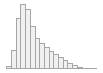</td>
<td>602<br />
(0.1%)</td>
</tr>
<tr class="odd">
<td>3</td>
<td>bmi<br />
[numeric]</td>
<td>Mean (sd) : 27.43 (4.8)<br />
min &lt; med &lt; max:<br />
12.12 &lt; 26.74 &lt; 74.68<br />
IQR (CV) : 5.77 (0.17)</td>
<td>46232 distinct values</td>
<td>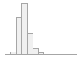</td>
<td>2990<br />
(0.6%)</td>
</tr>
<tr class="even">
<td>4</td>
<td>householdIncomeCat<br />
[character]</td>
<td>1. Greater than 31000<br />
2. Less than 31000</td>
<td>212709 (52.1%)<br />
195571 (47.9%)</td>
<td></td>
<td>73502<br />
(15.3%)</td>
</tr>
<tr class="odd">
<td>5</td>
<td>dateAssesment<br />
[Date]</td>
<td>min : 2006-03-13<br />
med : 2009-01-24<br />
max : 2010-10-01<br />
range : 4y 6m 18d</td>
<td>1068 distinct values</td>
<td>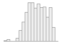</td>
<td>0<br />
(0.0%)</td>
</tr>
<tr class="even">
<td>6</td>
<td>pm10_2007<br />
[numeric]</td>
<td>Mean (sd) : 22.1 (2.87)<br />
min &lt; med &lt; max:<br />
11.81 &lt; 21.82 &lt; 37.19<br />
IQR (CV) : 3.43 (0.13)</td>
<td>1953 distinct values</td>
<td>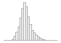</td>
<td>8147<br />
(1.7%)</td>
</tr>
<tr class="odd">
<td>7</td>
<td>pm10_2010<br />
[numeric]</td>
<td>Mean (sd) : 16.24 (1.9)<br />
min &lt; med &lt; max:<br />
11.78 &lt; 16.03 &lt; 31.39<br />
IQR (CV) : 1.76 (0.12)</td>
<td>1340 distinct values</td>
<td>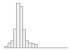</td>
<td>39821<br />
(8.3%)</td>
</tr>
<tr class="even">
<td>8</td>
<td>pm25Absorb_2010<br />
[numeric]</td>
<td>Mean (sd) : 1.19 (0.27)<br />
min &lt; med &lt; max:<br />
0.83 &lt; 1.13 &lt; 4.6<br />
IQR (CV) : 0.31 (0.23)</td>
<td>283 distinct values</td>
<td>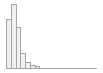</td>
<td>39821<br />
(8.3%)</td>
</tr>
<tr class="odd">
<td>9</td>
<td>pm25_2010<br />
[numeric]</td>
<td>Mean (sd) : 9.99 (1.06)<br />
min &lt; med &lt; max:<br />
8.17 &lt; 9.94 &lt; 21.31<br />
IQR (CV) : 1.28 (0.11)</td>
<td>852 distinct values</td>
<td>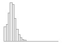</td>
<td>39821<br />
(8.3%)</td>
</tr>
<tr class="even">
<td>10</td>
<td>pmcourse_2010<br />
[numeric]</td>
<td>Mean (sd) : 6.43 (0.9)<br />
min &lt; med &lt; max:<br />
5.57 &lt; 6.11 &lt; 12.82<br />
IQR (CV) : 0.8 (0.14)</td>
<td>514 distinct values</td>
<td>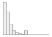</td>
<td>39821<br />
(8.3%)</td>
</tr>
<tr class="odd">
<td>11</td>
<td>no2_2005<br />
[numeric]</td>
<td>Mean (sd) : 29.92 (10.09)<br />
min &lt; med &lt; max:<br />
6.66 &lt; 28.38 &lt; 126.67<br />
IQR (CV) : 11.62 (0.34)</td>
<td>6449 distinct values</td>
<td>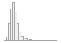</td>
<td>7090<br />
(1.5%)</td>
</tr>
<tr class="even">
<td>12</td>
<td>no2_2006<br />
[numeric]</td>
<td>Mean (sd) : 28.95 (9.16)<br />
min &lt; med &lt; max:<br />
6.74 &lt; 27.89 &lt; 131.07<br />
IQR (CV) : 10.51 (0.32)</td>
<td>6009 distinct values</td>
<td></td>
<td>7090<br />
(1.5%)</td>
</tr>
<tr class="odd">
<td>13</td>
<td>no2_2007<br />
[numeric]</td>
<td>Mean (sd) : 30.71 (10.68)<br />
min &lt; med &lt; max:<br />
6.99 &lt; 28.91 &lt; 138.39<br />
IQR (CV) : 11.34 (0.35)</td>
<td>6693 distinct values</td>
<td>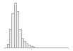</td>
<td>7090<br />
(1.5%)</td>
</tr>
<tr class="even">
<td>14</td>
<td>no2_2010<br />
[numeric]</td>
<td>Mean (sd) : 26.72 (7.58)<br />
min &lt; med &lt; max:<br />
12.93 &lt; 26.26 &lt; 108.49<br />
IQR (CV) : 9.78 (0.28)</td>
<td>5018 distinct values</td>
<td>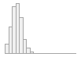</td>
<td>7090<br />
(1.5%)</td>
</tr>
<tr class="odd">
<td>15</td>
<td>no1_2010<br />
[numeric]</td>
<td>Mean (sd) : 44.13 (15.54)<br />
min &lt; med &lt; max:<br />
19.74 &lt; 42.44 &lt; 265.94<br />
IQR (CV) : 16.4 (0.35)</td>
<td>10016 distinct values</td>
<td>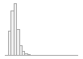</td>
<td>7090<br />
(1.5%)</td>
</tr>
<tr class="even">
<td>16</td>
<td>fuel<br />
[character]</td>
<td>1. A gas fire that you use r<br />
2. A gas fire that you use r<br />
3. A gas hob or gas cooker<br />
4. A gas hob or gas cooker|A<br />
5. A gas hob or gas cooker|A<br />
6. A gas hob or gas cooker|A<br />
7. An open solid fuel fire t<br />
8. Do not know<br />
9. None of the above<br />
10. Prefer not to answer</td>
<td>43025 ( 9.0%)<br />
1083 ( 0.2%)<br />
170644 (35.8%)<br />
138968 (29.1%)<br />
5645 ( 1.2%)<br />
21570 ( 4.5%)<br />
12299 ( 2.6%)<br />
339 ( 0.1%)<br />
82769 (17.3%)<br />
952 ( 0.2%)</td>
<td></td>
<td>4488<br />
(0.9%)</td>
</tr>
<tr class="odd">
<td>17</td>
<td>education<br />
[character]</td>
<td>1. None of the above<br />
2. College or University deg<br />
3. O levels/GCSEs or equival<br />
4. College or University deg<br />
5. NVQ or HND or HNC or equi<br />
6. Other professional qualif<br />
7. College or University deg<br />
8. CSEs or equivalent<br />
9. College or University deg<br />
10. O levels/GCSEs or equival<br />
[ 55 others ]</td>
<td>81067 (17.0%)<br />
54572 (11.4%)<br />
53601 (11.2%)<br />
33760 ( 7.1%)<br />
28237 ( 5.9%)<br />
24583 ( 5.2%)<br />
21773 ( 4.6%)<br />
18019 ( 3.8%)<br />
13712 ( 2.9%)<br />
13265 ( 2.8%)<br />
134702 (28.2%)</td>
<td></td>
<td>4491<br />
(0.9%)</td>
</tr>
<tr class="even">
<td>18</td>
<td>exposeSmokeHomeRaw<br />
[character]</td>
<td>1. 0<br />
2. Do not know<br />
3. 1<br />
4. 2<br />
5. Prefer not to answer<br />
6. 3<br />
7. 4<br />
8. 5<br />
9. 7<br />
10. 10<br />
[ 93 others ]</td>
<td>407584 (91.9%)<br />
9500 ( 2.1%)<br />
9316 ( 2.1%)<br />
3225 ( 0.7%)<br />
1537 ( 0.3%)<br />
1517 ( 0.3%)<br />
1259 ( 0.3%)<br />
1051 ( 0.2%)<br />
947 ( 0.2%)<br />
702 ( 0.2%)<br />
6682 ( 1.5%)</td>
<td></td>
<td>38462<br />
(8.0%)</td>
</tr>
<tr class="odd">
<td>19</td>
<td>timeCurrentAddress<br />
[character]</td>
<td>1. 10<br />
2. 2<br />
3. 3<br />
4. 20<br />
5. 5<br />
6. 8<br />
7. 4<br />
8. 25<br />
9. 7<br />
10. 6<br />
[ 63 others ]</td>
<td>19659 ( 4.1%)<br />
19207 ( 4.0%)<br />
18934 ( 3.9%)<br />
18751 ( 3.9%)<br />
18261 ( 3.8%)<br />
16474 ( 3.4%)<br />
16092 ( 3.3%)<br />
15632 ( 3.3%)<br />
15559 ( 3.2%)<br />
15504 ( 3.2%)<br />
306863 (63.8%)</td>
<td></td>
<td>846<br />
(0.2%)</td>
</tr>
<tr class="even">
<td>20</td>
<td>dateLostFollowUp<br />
[character]</td>
<td>1. 2014-06-03<br />
2. 2012-01-11<br />
3. 2009-05-13<br />
4. 2009-05-27<br />
5. 2009-05-20<br />
6. 2009-05-21<br />
7. 2009-10-08<br />
8. 2010-06-09<br />
9. 2012-04-26<br />
10. 2009-05-14<br />
[ 580 others ]</td>
<td>245 (19.6%)<br />
38 ( 3.0%)<br />
9 ( 0.7%)<br />
9 ( 0.7%)<br />
7 ( 0.6%)<br />
7 ( 0.6%)<br />
7 ( 0.6%)<br />
7 ( 0.6%)<br />
7 ( 0.6%)<br />
6 ( 0.5%)<br />
911 (72.7%)</td>
<td></td>
<td>480529<br />
(99.7%)</td>
</tr>
<tr class="odd">
<td>21</td>
<td>dateCensor<br />
[character]</td>
<td>1. 2020-02-29<br />
2. 2021-01-31</td>
<td>447221 (92.8%)<br />
34561 ( 7.2%)</td>
<td></td>
<td>0<br />
(0.0%)</td>
</tr>
<tr class="even">
<td>22</td>
<td>dateCutoff<br />
[character]</td>
<td>1. 2020-02-29<br />
2. 2021-01-31<br />
3. 2014-06-03<br />
4. 2012-01-11<br />
5. 2009-05-13<br />
6. 2009-05-27<br />
7. 2009-05-20<br />
8. 2009-05-21<br />
9. 2009-10-08<br />
10. 2010-06-09<br />
[ 582 others ]</td>
<td>446021 (92.6%)<br />
34508 ( 7.2%)<br />
245 ( 0.1%)<br />
38 ( 0.0%)<br />
9 ( 0.0%)<br />
9 ( 0.0%)<br />
7 ( 0.0%)<br />
7 ( 0.0%)<br />
7 ( 0.0%)<br />
7 ( 0.0%)<br />
924 ( 0.2%)</td>
<td></td>
<td>0<br />
(0.0%)</td>
</tr>
<tr class="odd">
<td>23</td>
<td>date_of_death<br />
[character]</td>
<td>1. 2020-04-22<br />
2. 2020-04-15<br />
3. 2020-04-10<br />
4. 2021-01-23<br />
5. 2021-01-28<br />
6. 2021-01-29<br />
7. 2020-03-30<br />
8. 2020-04-02<br />
9. 2020-04-11<br />
10. 2020-04-14<br />
[ 4801 others ]</td>
<td>36 ( 0.1%)<br />
33 ( 0.1%)<br />
29 ( 0.1%)<br />
28 ( 0.1%)<br />
28 ( 0.1%)<br />
27 ( 0.1%)<br />
26 ( 0.1%)<br />
26 ( 0.1%)<br />
26 ( 0.1%)<br />
26 ( 0.1%)<br />
34269 (99.2%)</td>
<td></td>
<td>447228<br />
(92.8%)</td>
</tr>
<tr class="even">
<td>24</td>
<td>ageBaseline<br />
[numeric]</td>
<td>Mean (sd) : 56.89 (8.1)<br />
min &lt; med &lt; max:<br />
37.42 &lt; 58.07 &lt; 73.69<br />
IQR (CV) : 13.2 (0.14)</td>
<td>11080 distinct values</td>
<td>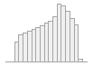</td>
<td>1<br />
(0.0%)</td>
</tr>
<tr class="odd">
<td>25</td>
<td>race<br />
[character]</td>
<td>1. Asian<br />
2. Black<br />
3. Other<br />
4. White</td>
<td>11216 ( 2.3%)<br />
7811 ( 1.6%)<br />
7293 ( 1.5%)<br />
452768 (94.5%)</td>
<td></td>
<td>2694<br />
(0.6%)</td>
</tr>
<tr class="even">
<td>26</td>
<td>sex<br />
[character]</td>
<td>1. Female<br />
2. Male</td>
<td>260395 (54.0%)<br />
221387 (46.0%)</td>
<td></td>
<td>0<br />
(0.0%)</td>
</tr>
<tr class="odd">
<td>27</td>
<td>packYear<br />
[numeric]</td>
<td>Mean (sd) : 8.27 (15.8)<br />
min &lt; med &lt; max:<br />
0 &lt; 0 &lt; 336<br />
IQR (CV) : 11.25 (1.91)</td>
<td>1493 distinct values</td>
<td>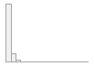</td>
<td>74643<br />
(15.5%)</td>
</tr>
<tr class="even">
<td>28</td>
<td>smokingCat<br />
[character]</td>
<td>1. Current smoker &gt;19 pack y<br />
2. Current smoker 1-19 pack<br />
3. Current smoker unknown pa<br />
4. Never smoker<br />
5. Past smoker &gt;19 pack year<br />
6. Past smoker 1-19 pack yea<br />
7. Past smoker unknown pack</td>
<td>25874 ( 5.4%)<br />
14926 ( 3.1%)<br />
10432 ( 2.2%)<br />
262802 (54.9%)<br />
46005 ( 9.6%)<br />
57509 (12.0%)<br />
61425 (12.8%)</td>
<td></td>
<td>2809<br />
(0.6%)</td>
</tr>
<tr class="odd">
<td>29</td>
<td>pm10_2007per10<br />
[numeric]</td>
<td>Mean (sd) : 2.21 (0.29)<br />
min &lt; med &lt; max:<br />
1.18 &lt; 2.18 &lt; 3.72<br />
IQR (CV) : 0.34 (0.13)</td>
<td>1953 distinct values</td>
<td></td>
<td>8147<br />
(1.7%)</td>
</tr>
<tr class="even">
<td>30</td>
<td>pm10_2010per10<br />
[numeric]</td>
<td>Mean (sd) : 1.62 (0.19)<br />
min &lt; med &lt; max:<br />
1.18 &lt; 1.6 &lt; 3.14<br />
IQR (CV) : 0.18 (0.12)</td>
<td>1340 distinct values</td>
<td></td>
<td>39821<br />
(8.3%)</td>
</tr>
<tr class="odd">
<td>31</td>
<td>pm25_2010per5<br />
[numeric]</td>
<td>Mean (sd) : 2 (0.21)<br />
min &lt; med &lt; max:<br />
1.63 &lt; 1.99 &lt; 4.26<br />
IQR (CV) : 0.26 (0.11)</td>
<td>852 distinct values</td>
<td></td>
<td>39821<br />
(8.3%)</td>
</tr>
<tr class="even">
<td>32</td>
<td>pmcourse_2010per5<br />
[numeric]</td>
<td>Mean (sd) : 1.29 (0.18)<br />
min &lt; med &lt; max:<br />
1.11 &lt; 1.22 &lt; 2.56<br />
IQR (CV) : 0.16 (0.14)</td>
<td>514 distinct values</td>
<td></td>
<td>39821<br />
(8.3%)</td>
</tr>
<tr class="odd">
<td>33</td>
<td>no2_2005per10<br />
[numeric]</td>
<td>Mean (sd) : 2.99 (1.01)<br />
min &lt; med &lt; max:<br />
0.67 &lt; 2.84 &lt; 12.67<br />
IQR (CV) : 1.16 (0.34)</td>
<td>6449 distinct values</td>
<td></td>
<td>7090<br />
(1.5%)</td>
</tr>
<tr class="even">
<td>34</td>
<td>no2_2006per10<br />
[numeric]</td>
<td>Mean (sd) : 2.89 (0.92)<br />
min &lt; med &lt; max:<br />
0.67 &lt; 2.79 &lt; 13.11<br />
IQR (CV) : 1.05 (0.32)</td>
<td>6009 distinct values</td>
<td>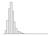</td>
<td>7090<br />
(1.5%)</td>
</tr>
<tr class="odd">
<td>35</td>
<td>no2_2007per10<br />
[numeric]</td>
<td>Mean (sd) : 3.07 (1.07)<br />
min &lt; med &lt; max:<br />
0.7 &lt; 2.89 &lt; 13.84<br />
IQR (CV) : 1.13 (0.35)</td>
<td>6693 distinct values</td>
<td></td>
<td>7090<br />
(1.5%)</td>
</tr>
<tr class="even">
<td>36</td>
<td>no2_2010per10<br />
[numeric]</td>
<td>Mean (sd) : 2.67 (0.76)<br />
min &lt; med &lt; max:<br />
1.29 &lt; 2.63 &lt; 10.85<br />
IQR (CV) : 0.98 (0.28)</td>
<td>5018 distinct values</td>
<td></td>
<td>7090<br />
(1.5%)</td>
</tr>
<tr class="odd">
<td>37</td>
<td>no1_2010per20<br />
[numeric]</td>
<td>Mean (sd) : 2.21 (0.78)<br />
min &lt; med &lt; max:<br />
0.99 &lt; 2.12 &lt; 13.3<br />
IQR (CV) : 0.82 (0.35)</td>
<td>10016 distinct values</td>
<td></td>
<td>7090<br />
(1.5%)</td>
</tr>
<tr class="even">
<td>38</td>
<td>bmiCat<br />
[character]</td>
<td>1. Normal<br />
2. Obese<br />
3. Overweight<br />
4. Underweight</td>
<td>155810 (32.5%)<br />
116985 (24.4%)<br />
203508 (42.5%)<br />
2489 ( 0.5%)</td>
<td></td>
<td>2990<br />
(0.6%)</td>
</tr>
<tr class="odd">
<td>39</td>
<td>baselineDate<br />
[character]</td>
<td>1. 11/14/2008<br />
2. 8/14/2008<br />
3. 3/17/2009<br />
4. 3/19/2009<br />
5. 4/15/2008<br />
6. 7/24/2008<br />
7. 5/30/2008<br />
8. 7/14/2008<br />
9. 8/13/2008<br />
10. 2/9/2009<br />
[ 1046 others ]</td>
<td>100 ( 0.2%)<br />
99 ( 0.2%)<br />
96 ( 0.2%)<br />
92 ( 0.2%)<br />
92 ( 0.2%)<br />
92 ( 0.2%)<br />
90 ( 0.2%)<br />
90 ( 0.2%)<br />
90 ( 0.2%)<br />
89 ( 0.2%)<br />
51291 (98.2%)</td>
<td></td>
<td>429561<br />
(89.2%)</td>
</tr>
<tr class="even">
<td>40</td>
<td>dob<br />
[character]</td>
<td>1. 3/15/1947<br />
2. 12/15/1946<br />
3. 4/15/1944<br />
4. 1/15/1947<br />
5. 10/15/1944<br />
6. 2/15/1947<br />
7. 6/15/1944<br />
8. 5/15/1947<br />
9. 3/15/1944<br />
10. 5/15/1944<br />
[ 393 others ]</td>
<td>367 ( 0.7%)<br />
343 ( 0.7%)<br />
341 ( 0.7%)<br />
338 ( 0.6%)<br />
334 ( 0.6%)<br />
334 ( 0.6%)<br />
330 ( 0.6%)<br />
329 ( 0.6%)<br />
328 ( 0.6%)<br />
324 ( 0.6%)<br />
48853 (93.6%)</td>
<td></td>
<td>429561<br />
(89.2%)</td>
</tr>
<tr class="odd">
<td>41</td>
<td>cancerDate<br />
[character]</td>
<td>1. 7/25/2019<br />
2. 8/1/2016<br />
3. 12/7/2017<br />
4. 4/9/2014<br />
5. 12/19/2019<br />
6. 4/5/2016<br />
7. 11/21/2016<br />
8. 2/3/2015<br />
9. 3/27/2014<br />
10. 5/21/2018<br />
[ 4253 others ]</td>
<td>36 ( 0.1%)<br />
36 ( 0.1%)<br />
34 ( 0.1%)<br />
34 ( 0.1%)<br />
33 ( 0.1%)<br />
33 ( 0.1%)<br />
32 ( 0.1%)<br />
32 ( 0.1%)<br />
32 ( 0.1%)<br />
32 ( 0.1%)<br />
51887 (99.4%)</td>
<td></td>
<td>429561<br />
(89.2%)</td>
</tr>
<tr class="even">
<td>42</td>
<td>cancerICD10<br />
[character]</td>
<td>1. C61<br />
2. C509<br />
3. C504<br />
4. C341<br />
5. C20<br />
6. C541<br />
7. C64<br />
8. C187<br />
9. C343<br />
10. C56<br />
[ 371 others ]</td>
<td>10581 (20.3%)<br />
3270 ( 6.3%)<br />
2869 ( 5.5%)<br />
1952 ( 3.7%)<br />
1570 ( 3.0%)<br />
1417 ( 2.7%)<br />
1387 ( 2.7%)<br />
1267 ( 2.4%)<br />
1074 ( 2.1%)<br />
963 ( 1.8%)<br />
25871 (49.5%)</td>
<td></td>
<td>429561<br />
(89.2%)</td>
</tr>
<tr class="odd">
<td>43</td>
<td>cancerHistology<br />
[numeric]</td>
<td>Mean (sd) : 8446.11 (502.99)<br />
min &lt; med &lt; max:<br />
8000 &lt; 8144 &lt; 9989<br />
IQR (CV) : 360 (0.06)</td>
<td>315 distinct values</td>
<td>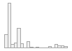</td>
<td>429887<br />
(89.2%)</td>
</tr>
<tr class="even">
<td>44</td>
<td>cancerBehaviour<br />
[character]</td>
<td>1. Malignant, metastatic sit<br />
2. Malignant, microinvasive<br />
3. Malignant, primary site<br />
4. Malignant, uncertain whet<br />
5. Uncertain whether benign</td>
<td>565 ( 1.1%)<br />
91 ( 0.2%)<br />
50484 (97.3%)<br />
7 ( 0.0%)<br />
748 ( 1.4%)</td>
<td></td>
<td>429887<br />
(89.2%)</td>
</tr>
<tr class="odd">
<td>45</td>
<td>meaning<br />
[character]</td>
<td>1. C61 Malignant neoplasm of<br />
2. C50.9 Breast, unspecified<br />
3. C50.4 Upper-outer quadran<br />
4. C34.1 Upper lobe, bronchu<br />
5. C20 Malignant neoplasm of<br />
6. C54.1 Endometrium<br />
7. C64 Malignant neoplasm of<br />
8. C18.7 Sigmoid colon<br />
9. C34.3 Lower lobe, bronchu<br />
10. C56 Malignant neoplasm of<br />
[ 371 others ]</td>
<td>10581 (20.3%)<br />
3270 ( 6.3%)<br />
2869 ( 5.5%)<br />
1952 ( 3.7%)<br />
1570 ( 3.0%)<br />
1417 ( 2.7%)<br />
1387 ( 2.7%)<br />
1267 ( 2.4%)<br />
1074 ( 2.1%)<br />
963 ( 1.8%)<br />
25871 (49.5%)</td>
<td></td>
<td>429561<br />
(89.2%)</td>
</tr>
<tr class="even">
<td>46</td>
<td>ICD10group<br />
[character]</td>
<td>1. C61<br />
2. C50<br />
3. C34<br />
4. C18<br />
5. C43<br />
6. C20<br />
7. C54<br />
8. C64<br />
9. C25<br />
10. C67<br />
[ 65 others ]</td>
<td>10581 (22.5%)<br />
9431 (20.1%)<br />
4078 ( 8.7%)<br />
3718 ( 7.9%)<br />
2908 ( 6.2%)<br />
1570 ( 3.3%)<br />
1439 ( 3.1%)<br />
1387 ( 3.0%)<br />
1249 ( 2.7%)<br />
1091 ( 2.3%)<br />
9530 (20.3%)</td>
<td></td>
<td>434800<br />
(90.2%)</td>
</tr>
<tr class="odd">
<td>47</td>
<td>prior_cancer<br />
[numeric]</td>
<td>1 distinct value</td>
<td>0 : 481782 (100.0%)</td>
<td></td>
<td>0<br />
(0.0%)</td>
</tr>
<tr class="even">
<td>48</td>
<td>lung_cancer<br />
[numeric]</td>
<td>Min : 0<br />
Mean : 0.01<br />
Max : 1</td>
<td>0 : 477701 (99.2%)<br />
1 : 4081 ( 0.8%)</td>
<td></td>
<td>0<br />
(0.0%)</td>
</tr>
<tr class="odd">
<td>49</td>
<td>t_lungCancer<br />
[numeric]</td>
<td>Mean (sd) : 6.2 (3.16)<br />
min &lt; med &lt; max:<br />
0.02 &lt; 6.39 &lt; 13.9<br />
IQR (CV) : 5.12 (0.51)</td>
<td>2626 distinct values</td>
<td>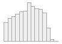</td>
<td>477701<br />
(99.2%)</td>
</tr>
<tr class="even">
<td>50</td>
<td>cancerDate_Lung<br />
[character]</td>
<td>1. 12/15/2010<br />
2. 12/4/2012<br />
3. 1/10/2013<br />
4. 1/11/2016<br />
5. 1/2/2014<br />
6. 1/5/2017<br />
7. 10/1/2018<br />
8. 10/12/2009<br />
9. 10/14/2010<br />
10. 10/20/2009<br />
[ 505 others ]</td>
<td>3 ( 0.5%)<br />
3 ( 0.5%)<br />
2 ( 0.4%)<br />
2 ( 0.4%)<br />
2 ( 0.4%)<br />
2 ( 0.4%)<br />
2 ( 0.4%)<br />
2 ( 0.4%)<br />
2 ( 0.4%)<br />
2 ( 0.4%)<br />
546 (96.1%)</td>
<td></td>
<td>481214<br />
(99.9%)</td>
</tr>
</tbody>
</table>

``` r
kable(head(df_pheno))
```

|     eid |  townsend |     bmi | householdIncomeCat | dateAssesment | pm10_2007 | pm10_2010 | pm25Absorb_2010 | pm25_2010 | pmcourse_2010 | no2_2005 | no2_2006 | no2_2007 | no2_2010 | no1_2010 | fuel                                                                      | education                                                                                                                                             | exposeSmokeHomeRaw | timeCurrentAddress | dateLostFollowUp | dateCensor | dateCutoff | date_of_death | ageBaseline | race  | sex    | packYear | smokingCat                    | pm10_2007per10 | pm10_2010per10 | pm25_2010per5 | pmcourse_2010per5 | no2_2005per10 | no2_2006per10 | no2_2007per10 | no2_2010per10 | no1_2010per20 | bmiCat     | baselineDate | dob        | cancerDate | cancerICD10 | cancerHistology | cancerBehaviour         | meaning                              | ICD10group | prior_cancer | lung_cancer | t_lungCancer | cancerDate_Lung |
|--------:|----------:|--------:|:-------------------|:--------------|----------:|----------:|----------------:|----------:|--------------:|---------:|---------:|---------:|---------:|---------:|:--------------------------------------------------------------------------|:------------------------------------------------------------------------------------------------------------------------------------------------------|:-------------------|:-------------------|:-----------------|:-----------|:-----------|:--------------|------------:|:------|:-------|---------:|:------------------------------|---------------:|---------------:|--------------:|------------------:|--------------:|--------------:|--------------:|--------------:|--------------:|:-----------|:-------------|:-----------|:-----------|:------------|----------------:|:------------------------|:-------------------------------------|:-----------|-------------:|------------:|-------------:|:----------------|
| 1000018 | -4.517900 | 24.1274 | Greater than 31000 | 2009-05-23    |     24.13 |     15.98 |            1.15 |     10.32 |          6.00 |    29.48 |    29.65 |    30.31 |    29.92 |    46.81 | A gas hob or gas cooker                                                   | O levels/GCSEs or equivalent\|NVQ or HND or HNC or equivalent                                                                                         | 0                  | 4                  | NA               | 2020-02-29 | 2020-02-29 | NA            |    43.51814 | White | Male   |       NA | Past smoker unknown pack year |          2.413 |          1.598 |         2.064 |             1.200 |         2.948 |         2.965 |         3.031 |         2.992 |        2.3405 | Normal     | 5/23/2009    | 11/15/1965 | 7/23/2015  | C822        |            9698 | Malignant, primary site | C82.2 Large cell, follicular         | NA         |            0 |           0 |           NA | NA              |
| 1000020 | -3.607660 | 28.9216 | Greater than 31000 | 2007-08-03    |     21.08 |     17.15 |            1.00 |      9.37 |          6.70 |    20.61 |    19.94 |    21.93 |    17.50 |    33.00 | None of the above                                                         | CSEs or equivalent                                                                                                                                    | 0                  | 27                 | NA               | 2020-02-29 | 2020-02-29 | NA            |    57.13347 | White | Female |     0.00 | Never smoker                  |          2.108 |          1.715 |         1.874 |             1.340 |         2.061 |         1.994 |         2.193 |         1.750 |        1.6500 | Overweight | NA           | NA         | NA         | NA          |              NA | NA                      | NA                                   | NA         |            0 |           0 |           NA | NA              |
| 1000037 | -1.198350 | 32.7558 | NA                 | 2009-11-05    |     25.50 |     14.04 |            0.89 |      9.54 |          5.61 |    19.12 |    18.02 |    20.65 |    19.66 |    38.84 | A gas hob or gas cooker                                                   | O levels/GCSEs or equivalent                                                                                                                          | 45                 | 21                 | NA               | 2020-02-29 | 2020-02-29 | NA            |    60.05749 | White | Female |    76.00 | Past smoker \>19 pack year    |          2.550 |          1.404 |         1.908 |             1.122 |         1.912 |         1.802 |         2.065 |         1.966 |        1.9420 | Obese      | 11/5/2009    | 10/15/1949 | 10/22/2013 | C504        |            8500 | Malignant, primary site | C50.4 Upper-outer quadrant of breast | C50        |            0 |           0 |           NA | NA              |
| 1000043 |  4.682530 | 26.7563 | Greater than 31000 | 2007-05-12    |     26.95 |     16.66 |            1.43 |     10.38 |          6.24 |    50.80 |    48.50 |    53.12 |    34.31 |    51.70 | None of the above                                                         | College or University degree                                                                                                                          | 0                  | 7                  | NA               | 2020-02-29 | 2020-02-29 | NA            |    60.82409 | White | Male   |       NA | Past smoker unknown pack year |          2.695 |          1.666 |         2.076 |             1.248 |         5.080 |         4.850 |         5.312 |         3.431 |        2.5850 | Overweight | NA           | NA         | NA         | NA          |              NA | NA                      | NA                                   | NA         |            0 |           0 |           NA | NA              |
| 1000051 | -1.003240 | 28.3711 | NA                 | 2008-01-11    |     20.03 |     17.23 |            1.36 |     10.58 |          6.49 |    26.38 |    25.73 |    26.38 |    33.02 |    52.70 | A gas hob or gas cooker\|A gas fire that you use regularly in winter time | College or University degree\|A levels/AS levels or equivalent\|O levels/GCSEs or equivalent\|Other professional qualifications eg: nursing, teaching | 0                  | 43                 | NA               | 2020-02-29 | 2020-02-29 | 2015-10-19    |    67.73990 | White | Male   |     5.20 | Past smoker 1-19 pack year    |          2.003 |          1.723 |         2.116 |             1.298 |         2.638 |         2.573 |         2.638 |         3.302 |        2.6350 | Overweight | 1/11/2008    | 4/15/1940  | 9/10/2015  | C930        |            9891 | Malignant, primary site | C93.0 Acute monocytic leukaemia      | NA         |            0 |           0 |           NA | NA              |
| 1000066 | -0.541713 | 42.4953 | Less than 31000    | 2007-05-08    |     22.85 |     14.56 |            0.98 |      9.84 |          5.84 |    25.57 |    23.88 |    26.49 |    23.43 |    31.54 | A gas hob or gas cooker                                                   | O levels/GCSEs or equivalent\|CSEs or equivalent\|NVQ or HND or HNC or equivalent                                                                     | NA                 | 10                 | NA               | 2020-02-29 | 2020-02-29 | NA            |    42.89391 | White | Female |    18.75 | Current smoker 1-19 pack year |          2.285 |          1.456 |         1.968 |             1.168 |         2.557 |         2.388 |         2.649 |         2.343 |        1.5770 | Obese      | NA           | NA         | NA         | NA          |              NA | NA                      | NA                                   | NA         |            0 |           0 |           NA | NA              |

There are 4081 cases of lung cancer in the data set.

``` r
table(householdIncomeCat, useNA = "always")
```

    ## householdIncomeCat
    ## Greater than 31000    Less than 31000               <NA> 
    ##             212709             195571              73502

``` r
table(bmiCat, useNA = "always")
```

    ## bmiCat
    ##      Normal       Obese  Overweight Underweight        <NA> 
    ##      155810      116985      203508        2489        2990

Average packages of cigarettes per day multiplied by years smoking:
8.2749754

### Density Plots

``` r
kd_male <- density(na.omit(pm10_2007[sex=="Male"])) #define kernel density
plot(kd_male,
     col='blue',
     lwd=2,
     main = "Female/Male PM10_2007") #create kernel density plot
kd_female <- density(na.omit(pm10_2007[sex=="Female"]))
lines(kd_female,
      col='red',
      lwd=2)
```

<!-- -->

``` r
# fill in kernel density plot with specific color
# polygon(kd_male, col='blue', border='black')
# polygon(kd_female, col='red', border='black')
```

``` r
x1 = na.omit(pm10_2007[ageBaseline>=60])
x2 = na.omit(pm10_2007[ageBaseline<60])
plot_mult_density("pm10_2007 (blue=60 or over, red=under 60)", x1,x2)
```

<!-- -->

### Histograms

``` r
#define data
x1 = na.omit(pm10_2007[ageBaseline>=60])
x2 = na.omit(pm10_2007[ageBaseline<60])

#plot two histograms in same graph
hist(x1, col='red', main='pm10_2007', xlab='(μg/m3)')
hist(x2, col='green', add=TRUE)

#add legend
legend('topright', c('60 or Over', 'Under 60'), fill=c('red', 'green'))
```

<!-- -->

``` r
hist(pm25_2010, 
     main="Particulate matter air pollution (pm2.5) 2010",
     xlab="PM2.5 (μg/m3)",
     col="cadetblue",
     freq=FALSE,
     ylim=c(0,0.7))

#Plot lognormal distribution
xfit <- seq(min(pm25_2010, na.rm = TRUE),
            max(pm25_2010, na.rm = TRUE),
            length = 40)
yfit <- dlnorm(xfit,
               meanlog = log(mean(pm25_2010)),
               sdlog = log(sd(pm25_2010)))
lines(xfit, yfit, col = "black", lwd = 2)
```

<!-- -->

The distribution is right-skewed and appears to be a log normal
distribution.

``` r
par(mfrow=c(3,3))
hist(pm10_2007, 
     xlab="pm10_2007 (μg/m3)",
     col="cadetblue",
     freq=FALSE)

hist(pm10_2010, 
     xlab="pm10_2010 (μg/m3)",
     col="cadetblue",
     freq=FALSE)

hist(pmcourse_2010, 
     xlab="pmcourse_2010 (μg/m3)",
     col="cadetblue",
     freq=FALSE)

hist(no2_2005, 
     xlab="no2_2005 (μg/m3)",
     col="cadetblue",
     freq=FALSE)

hist(no2_2006, 
     xlab="no2_2006 (μg/m3)",
     col="cadetblue",
     freq=FALSE)

hist(no2_2007, 
     xlab="no2_2007 (μg/m3)",
     col="cadetblue",
     freq=FALSE)

hist(no2_2010, 
     xlab="no2_2010 (μg/m3)",
     col="cadetblue",
     freq=FALSE)

hist(no1_2010, 
     xlab="no1_2010 (μg/m3)",
     col="cadetblue",
     freq=FALSE)

hist(pm25_2010, 
     xlab="PM2.5 (μg/m3)",
     col="cadetblue",
     freq=FALSE)
```

<!-- -->

### Scatter Plots and Correlation Coefficients: pollutants

``` r
plot(pm10_2010, no2_2010)
```

<!-- -->

``` r
cor(pm10_2010, no2_2010, method="pearson", use="complete.obs")
```

    ## [1] 0.5055037

``` r
cor(pm10_2010, no2_2010, method="spearman", use="complete.obs")
```

    ## [1] 0.5398056

``` r
plot(pm10_2010,pm25_2010)
```

<!-- -->

``` r
cor(pm10_2010, pm25_2010, method="pearson", use="complete.obs")
```

    ## [1] 0.5325037

``` r
cor(pm10_2010, pm25_2010, method="spearman", use="complete.obs")
```

    ## [1] 0.5687892

``` r
plot(no1_2010, no2_2010)
```

<!-- -->

``` r
cor(no1_2010, no2_2010, method="pearson", use="complete.obs")
```

    ## [1] 0.9219059

``` r
cor(no1_2010, no2_2010, method="spearman", use="complete.obs")
```

    ## [1] 0.9144932

### Scatter Plots and Correlation Coefficients: pollutants and covariates

``` r
cor(pm25_2010, ageBaseline, use="pairwise.complete.obs")
```

    ## [1] -0.07250032

``` r
cor(pm25_2010, bmi, use="pairwise.complete.obs")
```

    ## [1] 0.04181106

``` r
cor(pm25_2010, packYear, use="pairwise.complete.obs")
```

    ## [1] 0.07892377

### PM 2.5

#### Box Plot

``` r
quantile(pm25_2010, na.rm=TRUE)
```

    ##    0%   25%   50%   75%  100% 
    ##  8.17  9.29  9.94 10.57 21.31

``` r
iqr <- IQR(pm25_2010, na.rm=TRUE)

boxplot(pm25_2010, 
        horizontal=TRUE,
        col="cadetblue")
```

<!-- -->

#### QQ Plot

``` r
qqnorm(pm25_2010)
qqline(pm25_2010)
```

<!-- -->

#### Outliers

``` r
extremeOut <- 3*iqr
mildOut <- 1.5*iqr

extremePM25 <- subset(df_pheno, pm25_2010 > (mean(pm25_2010, na.rm=TRUE)+ extremeOut))
mildPM25 <- subset(df_pheno, pm25_2010 > (mean(pm25_2010, na.rm=TRUE)+ mildOut))
```

There are 958 extreme outliers and 20992 mild outliers for PM2.5 data
from 2010.

#### Correlation Coefficients: pollutant extreme outliers and covariates

``` r
cor(extremePM25$pm25_2010, extremePM25$ageBaseline)
```

    ## [1] 0.04268743

``` r
cor(extremePM25$pm25_2010, extremePM25$bmi, use="pairwise.complete.obs")
```

    ## [1] 0.0300583

``` r
cor(extremePM25$pm25_2010, extremePM25$packYear, use="pairwise.complete.obs")
```

    ## [1] -0.01779504

#### Correlation Coefficients: pollutant mild outliers and covariates

``` r
cor(mildPM25$pm25_2010, mildPM25$ageBaseline, use="pairwise.complete.obs")
```

    ## [1] 0.003296757

``` r
cor(mildPM25$pm25_2010, mildPM25$bmi, use="pairwise.complete.obs")
```

    ## [1] -0.004101232

``` r
cor(mildPM25$pm25_2010, mildPM25$packYear, use="pairwise.complete.obs")
```

    ## [1] 0.009053578

``` r
rm(mildPM25, extremePM25)
```

## Regression: Cox Proportional-Hazards Model

### Model 1: age and sex covariates only

#### PM2.5 (2010)

``` r
res.model1 <- coxph(
  Surv(t_lungCancer, lung_cancer) ~  pm25_2010per5 + ageBaseline + sex,
  data = df_pheno,
  ties = "efron"
)
```

#### PM2.5 (2010)

### Model 2: multiple covariates

``` r
res.model2 <- coxph(
  Surv(t_lungCancer, lung_cancer) ~ pm25_2010per5 + ageBaseline + sex + householdIncomeCat + education + bmi + smokingCat,
  data = df_pheno,
  ties = "efron"
)
res.model2
```

    ## Call:
    ## coxph(formula = Surv(t_lungCancer, lung_cancer) ~ pm25_2010per5 + 
    ##     ageBaseline + sex + householdIncomeCat + education + bmi + 
    ##     smokingCat, data = df_pheno, ties = "efron")
    ## 
    ##                                                                                                                                                                                                  coef
    ## pm25_2010per5                                                                                                                                                                               -0.050616
    ## ageBaseline                                                                                                                                                                                  0.009078
    ## sexMale                                                                                                                                                                                      0.036180
    ## householdIncomeCatLess than 31000                                                                                                                                                           -0.048346
    ## educationA levels/AS levels or equivalent|CSEs or equivalent                                                                                                                                -0.159542
    ## educationA levels/AS levels or equivalent|CSEs or equivalent|Other professional qualifications eg: nursing, teaching                                                                         0.797695
    ## educationA levels/AS levels or equivalent|NVQ or HND or HNC or equivalent                                                                                                                    0.166554
    ## educationA levels/AS levels or equivalent|NVQ or HND or HNC or equivalent|Other professional qualifications eg: nursing, teaching                                                            0.833525
    ## educationA levels/AS levels or equivalent|O levels/GCSEs or equivalent                                                                                                                      -0.079855
    ## educationA levels/AS levels or equivalent|O levels/GCSEs or equivalent|CSEs or equivalent                                                                                                   -0.131069
    ## educationA levels/AS levels or equivalent|O levels/GCSEs or equivalent|CSEs or equivalent|NVQ or HND or HNC or equivalent                                                                    1.162055
    ## educationA levels/AS levels or equivalent|O levels/GCSEs or equivalent|CSEs or equivalent|NVQ or HND or HNC or equivalent|Other professional qualifications eg: nursing, teaching            0.626790
    ## educationA levels/AS levels or equivalent|O levels/GCSEs or equivalent|CSEs or equivalent|Other professional qualifications eg: nursing, teaching                                            0.361469
    ## educationA levels/AS levels or equivalent|O levels/GCSEs or equivalent|NVQ or HND or HNC or equivalent                                                                                      -0.190418
    ## educationA levels/AS levels or equivalent|O levels/GCSEs or equivalent|NVQ or HND or HNC or equivalent|Other professional qualifications eg: nursing, teaching                               0.736204
    ## educationA levels/AS levels or equivalent|O levels/GCSEs or equivalent|Other professional qualifications eg: nursing, teaching                                                               0.083912
    ## educationA levels/AS levels or equivalent|Other professional qualifications eg: nursing, teaching                                                                                           -0.046272
    ## educationCollege or University degree                                                                                                                                                        0.006269
    ## educationCollege or University degree|A levels/AS levels or equivalent                                                                                                                      -0.511664
    ## educationCollege or University degree|A levels/AS levels or equivalent|NVQ or HND or HNC or equivalent                                                                                       0.519589
    ## educationCollege or University degree|A levels/AS levels or equivalent|O levels/GCSEs or equivalent                                                                                          0.144486
    ## educationCollege or University degree|A levels/AS levels or equivalent|O levels/GCSEs or equivalent|CSEs or equivalent                                                                      -0.370512
    ## educationCollege or University degree|A levels/AS levels or equivalent|O levels/GCSEs or equivalent|CSEs or equivalent|Other professional qualifications eg: nursing, teaching               0.028460
    ## educationCollege or University degree|A levels/AS levels or equivalent|O levels/GCSEs or equivalent|NVQ or HND or HNC or equivalent                                                          0.463807
    ## educationCollege or University degree|A levels/AS levels or equivalent|O levels/GCSEs or equivalent|NVQ or HND or HNC or equivalent|Other professional qualifications eg: nursing, teaching -0.026925
    ## educationCollege or University degree|A levels/AS levels or equivalent|O levels/GCSEs or equivalent|Other professional qualifications eg: nursing, teaching                                  0.053873
    ## educationCollege or University degree|A levels/AS levels or equivalent|Other professional qualifications eg: nursing, teaching                                                               0.321478
    ## educationCollege or University degree|CSEs or equivalent                                                                                                                                    -0.630431
    ## educationCollege or University degree|NVQ or HND or HNC or equivalent                                                                                                                       -0.134116
    ## educationCollege or University degree|NVQ or HND or HNC or equivalent|Other professional qualifications eg: nursing, teaching                                                                0.949619
    ## educationCollege or University degree|O levels/GCSEs or equivalent                                                                                                                           0.250362
    ## educationCollege or University degree|O levels/GCSEs or equivalent|CSEs or equivalent                                                                                                       -0.431709
    ## educationCollege or University degree|O levels/GCSEs or equivalent|CSEs or equivalent|Other professional qualifications eg: nursing, teaching                                                0.408775
    ## educationCollege or University degree|O levels/GCSEs or equivalent|NVQ or HND or HNC or equivalent                                                                                          -0.498501
    ## educationCollege or University degree|O levels/GCSEs or equivalent|NVQ or HND or HNC or equivalent|Other professional qualifications eg: nursing, teaching                                  -0.175997
    ## educationCollege or University degree|O levels/GCSEs or equivalent|Other professional qualifications eg: nursing, teaching                                                                  -0.274875
    ## educationCollege or University degree|Other professional qualifications eg: nursing, teaching                                                                                               -0.023706
    ## educationCSEs or equivalent                                                                                                                                                                  0.096886
    ## educationCSEs or equivalent|NVQ or HND or HNC or equivalent                                                                                                                                  0.179470
    ## educationCSEs or equivalent|NVQ or HND or HNC or equivalent|Other professional qualifications eg: nursing, teaching                                                                          0.040447
    ## educationCSEs or equivalent|Other professional qualifications eg: nursing, teaching                                                                                                         -0.375133
    ## educationNone of the above                                                                                                                                                                   0.143171
    ## educationNVQ or HND or HNC or equivalent                                                                                                                                                     0.026126
    ## educationNVQ or HND or HNC or equivalent|Other professional qualifications eg: nursing, teaching                                                                                             0.117891
    ## educationO levels/GCSEs or equivalent                                                                                                                                                        0.045515
    ## educationO levels/GCSEs or equivalent|CSEs or equivalent                                                                                                                                     0.120526
    ## educationO levels/GCSEs or equivalent|CSEs or equivalent|NVQ or HND or HNC or equivalent                                                                                                    -0.027070
    ## educationO levels/GCSEs or equivalent|CSEs or equivalent|NVQ or HND or HNC or equivalent|Other professional qualifications eg: nursing, teaching                                             0.837472
    ## educationO levels/GCSEs or equivalent|CSEs or equivalent|Other professional qualifications eg: nursing, teaching                                                                            -0.167878
    ## educationO levels/GCSEs or equivalent|NVQ or HND or HNC or equivalent                                                                                                                       -0.047979
    ## educationO levels/GCSEs or equivalent|NVQ or HND or HNC or equivalent|Other professional qualifications eg: nursing, teaching                                                               -0.016458
    ## educationO levels/GCSEs or equivalent|Other professional qualifications eg: nursing, teaching                                                                                               -0.074675
    ## educationOther professional qualifications eg: nursing, teaching                                                                                                                             0.022011
    ## educationPrefer not to answer                                                                                                                                                                0.266101
    ## bmi                                                                                                                                                                                         -0.007559
    ## smokingCatCurrent smoker 1-19 pack year                                                                                                                                                     -0.024314
    ## smokingCatCurrent smoker unknown pack year                                                                                                                                                  -0.152565
    ## smokingCatNever smoker                                                                                                                                                                       0.146561
    ## smokingCatPast smoker >19 pack year                                                                                                                                                          0.037771
    ## smokingCatPast smoker 1-19 pack year                                                                                                                                                         0.004727
    ## smokingCatPast smoker unknown pack year                                                                                                                                                      0.044378
    ##                                                                                                                                                                                             exp(coef)
    ## pm25_2010per5                                                                                                                                                                                0.950644
    ## ageBaseline                                                                                                                                                                                  1.009119
    ## sexMale                                                                                                                                                                                      1.036843
    ## householdIncomeCatLess than 31000                                                                                                                                                            0.952804
    ## educationA levels/AS levels or equivalent|CSEs or equivalent                                                                                                                                 0.852534
    ## educationA levels/AS levels or equivalent|CSEs or equivalent|Other professional qualifications eg: nursing, teaching                                                                         2.220416
    ## educationA levels/AS levels or equivalent|NVQ or HND or HNC or equivalent                                                                                                                    1.181227
    ## educationA levels/AS levels or equivalent|NVQ or HND or HNC or equivalent|Other professional qualifications eg: nursing, teaching                                                            2.301417
    ## educationA levels/AS levels or equivalent|O levels/GCSEs or equivalent                                                                                                                       0.923251
    ## educationA levels/AS levels or equivalent|O levels/GCSEs or equivalent|CSEs or equivalent                                                                                                    0.877157
    ## educationA levels/AS levels or equivalent|O levels/GCSEs or equivalent|CSEs or equivalent|NVQ or HND or HNC or equivalent                                                                    3.196497
    ## educationA levels/AS levels or equivalent|O levels/GCSEs or equivalent|CSEs or equivalent|NVQ or HND or HNC or equivalent|Other professional qualifications eg: nursing, teaching            1.871593
    ## educationA levels/AS levels or equivalent|O levels/GCSEs or equivalent|CSEs or equivalent|Other professional qualifications eg: nursing, teaching                                            1.435436
    ## educationA levels/AS levels or equivalent|O levels/GCSEs or equivalent|NVQ or HND or HNC or equivalent                                                                                       0.826614
    ## educationA levels/AS levels or equivalent|O levels/GCSEs or equivalent|NVQ or HND or HNC or equivalent|Other professional qualifications eg: nursing, teaching                               2.087994
    ## educationA levels/AS levels or equivalent|O levels/GCSEs or equivalent|Other professional qualifications eg: nursing, teaching                                                               1.087533
    ## educationA levels/AS levels or equivalent|Other professional qualifications eg: nursing, teaching                                                                                            0.954782
    ## educationCollege or University degree                                                                                                                                                        1.006288
    ## educationCollege or University degree|A levels/AS levels or equivalent                                                                                                                       0.599497
    ## educationCollege or University degree|A levels/AS levels or equivalent|NVQ or HND or HNC or equivalent                                                                                       1.681337
    ## educationCollege or University degree|A levels/AS levels or equivalent|O levels/GCSEs or equivalent                                                                                          1.155446
    ## educationCollege or University degree|A levels/AS levels or equivalent|O levels/GCSEs or equivalent|CSEs or equivalent                                                                       0.690381
    ## educationCollege or University degree|A levels/AS levels or equivalent|O levels/GCSEs or equivalent|CSEs or equivalent|Other professional qualifications eg: nursing, teaching               1.028869
    ## educationCollege or University degree|A levels/AS levels or equivalent|O levels/GCSEs or equivalent|NVQ or HND or HNC or equivalent                                                          1.590116
    ## educationCollege or University degree|A levels/AS levels or equivalent|O levels/GCSEs or equivalent|NVQ or HND or HNC or equivalent|Other professional qualifications eg: nursing, teaching  0.973435
    ## educationCollege or University degree|A levels/AS levels or equivalent|O levels/GCSEs or equivalent|Other professional qualifications eg: nursing, teaching                                  1.055350
    ## educationCollege or University degree|A levels/AS levels or equivalent|Other professional qualifications eg: nursing, teaching                                                               1.379164
    ## educationCollege or University degree|CSEs or equivalent                                                                                                                                     0.532362
    ## educationCollege or University degree|NVQ or HND or HNC or equivalent                                                                                                                        0.874489
    ## educationCollege or University degree|NVQ or HND or HNC or equivalent|Other professional qualifications eg: nursing, teaching                                                                2.584724
    ## educationCollege or University degree|O levels/GCSEs or equivalent                                                                                                                           1.284491
    ## educationCollege or University degree|O levels/GCSEs or equivalent|CSEs or equivalent                                                                                                        0.649398
    ## educationCollege or University degree|O levels/GCSEs or equivalent|CSEs or equivalent|Other professional qualifications eg: nursing, teaching                                                1.504973
    ## educationCollege or University degree|O levels/GCSEs or equivalent|NVQ or HND or HNC or equivalent                                                                                           0.607440
    ## educationCollege or University degree|O levels/GCSEs or equivalent|NVQ or HND or HNC or equivalent|Other professional qualifications eg: nursing, teaching                                   0.838621
    ## educationCollege or University degree|O levels/GCSEs or equivalent|Other professional qualifications eg: nursing, teaching                                                                   0.759667
    ## educationCollege or University degree|Other professional qualifications eg: nursing, teaching                                                                                                0.976573
    ## educationCSEs or equivalent                                                                                                                                                                  1.101735
    ## educationCSEs or equivalent|NVQ or HND or HNC or equivalent                                                                                                                                  1.196583
    ## educationCSEs or equivalent|NVQ or HND or HNC or equivalent|Other professional qualifications eg: nursing, teaching                                                                          1.041276
    ## educationCSEs or equivalent|Other professional qualifications eg: nursing, teaching                                                                                                          0.687198
    ## educationNone of the above                                                                                                                                                                   1.153927
    ## educationNVQ or HND or HNC or equivalent                                                                                                                                                     1.026470
    ## educationNVQ or HND or HNC or equivalent|Other professional qualifications eg: nursing, teaching                                                                                             1.125121
    ## educationO levels/GCSEs or equivalent                                                                                                                                                        1.046566
    ## educationO levels/GCSEs or equivalent|CSEs or equivalent                                                                                                                                     1.128090
    ## educationO levels/GCSEs or equivalent|CSEs or equivalent|NVQ or HND or HNC or equivalent                                                                                                     0.973293
    ## educationO levels/GCSEs or equivalent|CSEs or equivalent|NVQ or HND or HNC or equivalent|Other professional qualifications eg: nursing, teaching                                             2.310519
    ## educationO levels/GCSEs or equivalent|CSEs or equivalent|Other professional qualifications eg: nursing, teaching                                                                             0.845457
    ## educationO levels/GCSEs or equivalent|NVQ or HND or HNC or equivalent                                                                                                                        0.953153
    ## educationO levels/GCSEs or equivalent|NVQ or HND or HNC or equivalent|Other professional qualifications eg: nursing, teaching                                                                0.983677
    ## educationO levels/GCSEs or equivalent|Other professional qualifications eg: nursing, teaching                                                                                                0.928045
    ## educationOther professional qualifications eg: nursing, teaching                                                                                                                             1.022255
    ## educationPrefer not to answer                                                                                                                                                                1.304866
    ## bmi                                                                                                                                                                                          0.992469
    ## smokingCatCurrent smoker 1-19 pack year                                                                                                                                                      0.975979
    ## smokingCatCurrent smoker unknown pack year                                                                                                                                                   0.858503
    ## smokingCatNever smoker                                                                                                                                                                       1.157846
    ## smokingCatPast smoker >19 pack year                                                                                                                                                          1.038493
    ## smokingCatPast smoker 1-19 pack year                                                                                                                                                         1.004738
    ## smokingCatPast smoker unknown pack year                                                                                                                                                      1.045378
    ##                                                                                                                                                                                              se(coef)
    ## pm25_2010per5                                                                                                                                                                                0.087073
    ## ageBaseline                                                                                                                                                                                  0.003655
    ## sexMale                                                                                                                                                                                      0.039190
    ## householdIncomeCatLess than 31000                                                                                                                                                            0.047814
    ## educationA levels/AS levels or equivalent|CSEs or equivalent                                                                                                                                 1.010238
    ## educationA levels/AS levels or equivalent|CSEs or equivalent|Other professional qualifications eg: nursing, teaching                                                                         1.009522
    ## educationA levels/AS levels or equivalent|NVQ or HND or HNC or equivalent                                                                                                                    0.353745
    ## educationA levels/AS levels or equivalent|NVQ or HND or HNC or equivalent|Other professional qualifications eg: nursing, teaching                                                            0.590561
    ## educationA levels/AS levels or equivalent|O levels/GCSEs or equivalent                                                                                                                       0.186315
    ## educationA levels/AS levels or equivalent|O levels/GCSEs or equivalent|CSEs or equivalent                                                                                                    0.396601
    ## educationA levels/AS levels or equivalent|O levels/GCSEs or equivalent|CSEs or equivalent|NVQ or HND or HNC or equivalent                                                                    0.515744
    ## educationA levels/AS levels or equivalent|O levels/GCSEs or equivalent|CSEs or equivalent|NVQ or HND or HNC or equivalent|Other professional qualifications eg: nursing, teaching            0.591321
    ## educationA levels/AS levels or equivalent|O levels/GCSEs or equivalent|CSEs or equivalent|Other professional qualifications eg: nursing, teaching                                            1.009799
    ## educationA levels/AS levels or equivalent|O levels/GCSEs or equivalent|NVQ or HND or HNC or equivalent                                                                                       0.235403
    ## educationA levels/AS levels or equivalent|O levels/GCSEs or equivalent|NVQ or HND or HNC or equivalent|Other professional qualifications eg: nursing, teaching                               0.373256
    ## educationA levels/AS levels or equivalent|O levels/GCSEs or equivalent|Other professional qualifications eg: nursing, teaching                                                               0.192165
    ## educationA levels/AS levels or equivalent|Other professional qualifications eg: nursing, teaching                                                                                            0.232391
    ## educationCollege or University degree                                                                                                                                                        0.136432
    ## educationCollege or University degree|A levels/AS levels or equivalent                                                                                                                       0.590729
    ## educationCollege or University degree|A levels/AS levels or equivalent|NVQ or HND or HNC or equivalent                                                                                       1.007953
    ## educationCollege or University degree|A levels/AS levels or equivalent|O levels/GCSEs or equivalent                                                                                          0.166948
    ## educationCollege or University degree|A levels/AS levels or equivalent|O levels/GCSEs or equivalent|CSEs or equivalent                                                                       0.591046
    ## educationCollege or University degree|A levels/AS levels or equivalent|O levels/GCSEs or equivalent|CSEs or equivalent|Other professional qualifications eg: nursing, teaching               0.293026
    ## educationCollege or University degree|A levels/AS levels or equivalent|O levels/GCSEs or equivalent|NVQ or HND or HNC or equivalent                                                          0.463635
    ## educationCollege or University degree|A levels/AS levels or equivalent|O levels/GCSEs or equivalent|NVQ or HND or HNC or equivalent|Other professional qualifications eg: nursing, teaching  0.338226
    ## educationCollege or University degree|A levels/AS levels or equivalent|O levels/GCSEs or equivalent|Other professional qualifications eg: nursing, teaching                                  0.152421
    ## educationCollege or University degree|A levels/AS levels or equivalent|Other professional qualifications eg: nursing, teaching                                                               0.590990
    ## educationCollege or University degree|CSEs or equivalent                                                                                                                                     1.009115
    ## educationCollege or University degree|NVQ or HND or HNC or equivalent                                                                                                                        0.396989
    ## educationCollege or University degree|NVQ or HND or HNC or equivalent|Other professional qualifications eg: nursing, teaching                                                                0.590338
    ## educationCollege or University degree|O levels/GCSEs or equivalent                                                                                                                           0.302625
    ## educationCollege or University degree|O levels/GCSEs or equivalent|CSEs or equivalent                                                                                                        0.719274
    ## educationCollege or University degree|O levels/GCSEs or equivalent|CSEs or equivalent|Other professional qualifications eg: nursing, teaching                                                0.719074
    ## educationCollege or University degree|O levels/GCSEs or equivalent|NVQ or HND or HNC or equivalent                                                                                           0.514398
    ## educationCollege or University degree|O levels/GCSEs or equivalent|NVQ or HND or HNC or equivalent|Other professional qualifications eg: nursing, teaching                                   0.426566
    ## educationCollege or University degree|O levels/GCSEs or equivalent|Other professional qualifications eg: nursing, teaching                                                                   0.276838
    ## educationCollege or University degree|Other professional qualifications eg: nursing, teaching                                                                                                0.186910
    ## educationCSEs or equivalent                                                                                                                                                                  0.158932
    ## educationCSEs or equivalent|NVQ or HND or HNC or equivalent                                                                                                                                  0.226472
    ## educationCSEs or equivalent|NVQ or HND or HNC or equivalent|Other professional qualifications eg: nursing, teaching                                                                          0.516982
    ## educationCSEs or equivalent|Other professional qualifications eg: nursing, teaching                                                                                                          0.514573
    ## educationNone of the above                                                                                                                                                                   0.121447
    ## educationNVQ or HND or HNC or equivalent                                                                                                                                                     0.132852
    ## educationNVQ or HND or HNC or equivalent|Other professional qualifications eg: nursing, teaching                                                                                             0.235246
    ## educationO levels/GCSEs or equivalent                                                                                                                                                        0.127308
    ## educationO levels/GCSEs or equivalent|CSEs or equivalent                                                                                                                                     0.270263
    ## educationO levels/GCSEs or equivalent|CSEs or equivalent|NVQ or HND or HNC or equivalent                                                                                                     0.302865
    ## educationO levels/GCSEs or equivalent|CSEs or equivalent|NVQ or HND or HNC or equivalent|Other professional qualifications eg: nursing, teaching                                             0.515898
    ## educationO levels/GCSEs or equivalent|CSEs or equivalent|Other professional qualifications eg: nursing, teaching                                                                             0.338241
    ## educationO levels/GCSEs or equivalent|NVQ or HND or HNC or equivalent                                                                                                                        0.164809
    ## educationO levels/GCSEs or equivalent|NVQ or HND or HNC or equivalent|Other professional qualifications eg: nursing, teaching                                                                0.240122
    ## educationO levels/GCSEs or equivalent|Other professional qualifications eg: nursing, teaching                                                                                                0.166919
    ## educationOther professional qualifications eg: nursing, teaching                                                                                                                             0.138750
    ## educationPrefer not to answer                                                                                                                                                                0.225181
    ## bmi                                                                                                                                                                                          0.004168
    ## smokingCatCurrent smoker 1-19 pack year                                                                                                                                                      0.081208
    ## smokingCatCurrent smoker unknown pack year                                                                                                                                                   0.121883
    ## smokingCatNever smoker                                                                                                                                                                       0.063573
    ## smokingCatPast smoker >19 pack year                                                                                                                                                          0.049186
    ## smokingCatPast smoker 1-19 pack year                                                                                                                                                         0.075468
    ## smokingCatPast smoker unknown pack year                                                                                                                                                      0.076891
    ##                                                                                                                                                                                                  z
    ## pm25_2010per5                                                                                                                                                                               -0.581
    ## ageBaseline                                                                                                                                                                                  2.484
    ## sexMale                                                                                                                                                                                      0.923
    ## householdIncomeCatLess than 31000                                                                                                                                                           -1.011
    ## educationA levels/AS levels or equivalent|CSEs or equivalent                                                                                                                                -0.158
    ## educationA levels/AS levels or equivalent|CSEs or equivalent|Other professional qualifications eg: nursing, teaching                                                                         0.790
    ## educationA levels/AS levels or equivalent|NVQ or HND or HNC or equivalent                                                                                                                    0.471
    ## educationA levels/AS levels or equivalent|NVQ or HND or HNC or equivalent|Other professional qualifications eg: nursing, teaching                                                            1.411
    ## educationA levels/AS levels or equivalent|O levels/GCSEs or equivalent                                                                                                                      -0.429
    ## educationA levels/AS levels or equivalent|O levels/GCSEs or equivalent|CSEs or equivalent                                                                                                   -0.330
    ## educationA levels/AS levels or equivalent|O levels/GCSEs or equivalent|CSEs or equivalent|NVQ or HND or HNC or equivalent                                                                    2.253
    ## educationA levels/AS levels or equivalent|O levels/GCSEs or equivalent|CSEs or equivalent|NVQ or HND or HNC or equivalent|Other professional qualifications eg: nursing, teaching            1.060
    ## educationA levels/AS levels or equivalent|O levels/GCSEs or equivalent|CSEs or equivalent|Other professional qualifications eg: nursing, teaching                                            0.358
    ## educationA levels/AS levels or equivalent|O levels/GCSEs or equivalent|NVQ or HND or HNC or equivalent                                                                                      -0.809
    ## educationA levels/AS levels or equivalent|O levels/GCSEs or equivalent|NVQ or HND or HNC or equivalent|Other professional qualifications eg: nursing, teaching                               1.972
    ## educationA levels/AS levels or equivalent|O levels/GCSEs or equivalent|Other professional qualifications eg: nursing, teaching                                                               0.437
    ## educationA levels/AS levels or equivalent|Other professional qualifications eg: nursing, teaching                                                                                           -0.199
    ## educationCollege or University degree                                                                                                                                                        0.046
    ## educationCollege or University degree|A levels/AS levels or equivalent                                                                                                                      -0.866
    ## educationCollege or University degree|A levels/AS levels or equivalent|NVQ or HND or HNC or equivalent                                                                                       0.515
    ## educationCollege or University degree|A levels/AS levels or equivalent|O levels/GCSEs or equivalent                                                                                          0.865
    ## educationCollege or University degree|A levels/AS levels or equivalent|O levels/GCSEs or equivalent|CSEs or equivalent                                                                      -0.627
    ## educationCollege or University degree|A levels/AS levels or equivalent|O levels/GCSEs or equivalent|CSEs or equivalent|Other professional qualifications eg: nursing, teaching               0.097
    ## educationCollege or University degree|A levels/AS levels or equivalent|O levels/GCSEs or equivalent|NVQ or HND or HNC or equivalent                                                          1.000
    ## educationCollege or University degree|A levels/AS levels or equivalent|O levels/GCSEs or equivalent|NVQ or HND or HNC or equivalent|Other professional qualifications eg: nursing, teaching -0.080
    ## educationCollege or University degree|A levels/AS levels or equivalent|O levels/GCSEs or equivalent|Other professional qualifications eg: nursing, teaching                                  0.353
    ## educationCollege or University degree|A levels/AS levels or equivalent|Other professional qualifications eg: nursing, teaching                                                               0.544
    ## educationCollege or University degree|CSEs or equivalent                                                                                                                                    -0.625
    ## educationCollege or University degree|NVQ or HND or HNC or equivalent                                                                                                                       -0.338
    ## educationCollege or University degree|NVQ or HND or HNC or equivalent|Other professional qualifications eg: nursing, teaching                                                                1.609
    ## educationCollege or University degree|O levels/GCSEs or equivalent                                                                                                                           0.827
    ## educationCollege or University degree|O levels/GCSEs or equivalent|CSEs or equivalent                                                                                                       -0.600
    ## educationCollege or University degree|O levels/GCSEs or equivalent|CSEs or equivalent|Other professional qualifications eg: nursing, teaching                                                0.568
    ## educationCollege or University degree|O levels/GCSEs or equivalent|NVQ or HND or HNC or equivalent                                                                                          -0.969
    ## educationCollege or University degree|O levels/GCSEs or equivalent|NVQ or HND or HNC or equivalent|Other professional qualifications eg: nursing, teaching                                  -0.413
    ## educationCollege or University degree|O levels/GCSEs or equivalent|Other professional qualifications eg: nursing, teaching                                                                  -0.993
    ## educationCollege or University degree|Other professional qualifications eg: nursing, teaching                                                                                               -0.127
    ## educationCSEs or equivalent                                                                                                                                                                  0.610
    ## educationCSEs or equivalent|NVQ or HND or HNC or equivalent                                                                                                                                  0.792
    ## educationCSEs or equivalent|NVQ or HND or HNC or equivalent|Other professional qualifications eg: nursing, teaching                                                                          0.078
    ## educationCSEs or equivalent|Other professional qualifications eg: nursing, teaching                                                                                                         -0.729
    ## educationNone of the above                                                                                                                                                                   1.179
    ## educationNVQ or HND or HNC or equivalent                                                                                                                                                     0.197
    ## educationNVQ or HND or HNC or equivalent|Other professional qualifications eg: nursing, teaching                                                                                             0.501
    ## educationO levels/GCSEs or equivalent                                                                                                                                                        0.358
    ## educationO levels/GCSEs or equivalent|CSEs or equivalent                                                                                                                                     0.446
    ## educationO levels/GCSEs or equivalent|CSEs or equivalent|NVQ or HND or HNC or equivalent                                                                                                    -0.089
    ## educationO levels/GCSEs or equivalent|CSEs or equivalent|NVQ or HND or HNC or equivalent|Other professional qualifications eg: nursing, teaching                                             1.623
    ## educationO levels/GCSEs or equivalent|CSEs or equivalent|Other professional qualifications eg: nursing, teaching                                                                            -0.496
    ## educationO levels/GCSEs or equivalent|NVQ or HND or HNC or equivalent                                                                                                                       -0.291
    ## educationO levels/GCSEs or equivalent|NVQ or HND or HNC or equivalent|Other professional qualifications eg: nursing, teaching                                                               -0.069
    ## educationO levels/GCSEs or equivalent|Other professional qualifications eg: nursing, teaching                                                                                               -0.447
    ## educationOther professional qualifications eg: nursing, teaching                                                                                                                             0.159
    ## educationPrefer not to answer                                                                                                                                                                1.182
    ## bmi                                                                                                                                                                                         -1.814
    ## smokingCatCurrent smoker 1-19 pack year                                                                                                                                                     -0.299
    ## smokingCatCurrent smoker unknown pack year                                                                                                                                                  -1.252
    ## smokingCatNever smoker                                                                                                                                                                       2.305
    ## smokingCatPast smoker >19 pack year                                                                                                                                                          0.768
    ## smokingCatPast smoker 1-19 pack year                                                                                                                                                         0.063
    ## smokingCatPast smoker unknown pack year                                                                                                                                                      0.577
    ##                                                                                                                                                                                                  p
    ## pm25_2010per5                                                                                                                                                                               0.5610
    ## ageBaseline                                                                                                                                                                                 0.0130
    ## sexMale                                                                                                                                                                                     0.3559
    ## householdIncomeCatLess than 31000                                                                                                                                                           0.3120
    ## educationA levels/AS levels or equivalent|CSEs or equivalent                                                                                                                                0.8745
    ## educationA levels/AS levels or equivalent|CSEs or equivalent|Other professional qualifications eg: nursing, teaching                                                                        0.4294
    ## educationA levels/AS levels or equivalent|NVQ or HND or HNC or equivalent                                                                                                                   0.6378
    ## educationA levels/AS levels or equivalent|NVQ or HND or HNC or equivalent|Other professional qualifications eg: nursing, teaching                                                           0.1581
    ## educationA levels/AS levels or equivalent|O levels/GCSEs or equivalent                                                                                                                      0.6682
    ## educationA levels/AS levels or equivalent|O levels/GCSEs or equivalent|CSEs or equivalent                                                                                                   0.7410
    ## educationA levels/AS levels or equivalent|O levels/GCSEs or equivalent|CSEs or equivalent|NVQ or HND or HNC or equivalent                                                                   0.0242
    ## educationA levels/AS levels or equivalent|O levels/GCSEs or equivalent|CSEs or equivalent|NVQ or HND or HNC or equivalent|Other professional qualifications eg: nursing, teaching           0.2892
    ## educationA levels/AS levels or equivalent|O levels/GCSEs or equivalent|CSEs or equivalent|Other professional qualifications eg: nursing, teaching                                           0.7204
    ## educationA levels/AS levels or equivalent|O levels/GCSEs or equivalent|NVQ or HND or HNC or equivalent                                                                                      0.4186
    ## educationA levels/AS levels or equivalent|O levels/GCSEs or equivalent|NVQ or HND or HNC or equivalent|Other professional qualifications eg: nursing, teaching                              0.0486
    ## educationA levels/AS levels or equivalent|O levels/GCSEs or equivalent|Other professional qualifications eg: nursing, teaching                                                              0.6624
    ## educationA levels/AS levels or equivalent|Other professional qualifications eg: nursing, teaching                                                                                           0.8422
    ## educationCollege or University degree                                                                                                                                                       0.9634
    ## educationCollege or University degree|A levels/AS levels or equivalent                                                                                                                      0.3864
    ## educationCollege or University degree|A levels/AS levels or equivalent|NVQ or HND or HNC or equivalent                                                                                      0.6062
    ## educationCollege or University degree|A levels/AS levels or equivalent|O levels/GCSEs or equivalent                                                                                         0.3868
    ## educationCollege or University degree|A levels/AS levels or equivalent|O levels/GCSEs or equivalent|CSEs or equivalent                                                                      0.5307
    ## educationCollege or University degree|A levels/AS levels or equivalent|O levels/GCSEs or equivalent|CSEs or equivalent|Other professional qualifications eg: nursing, teaching              0.9226
    ## educationCollege or University degree|A levels/AS levels or equivalent|O levels/GCSEs or equivalent|NVQ or HND or HNC or equivalent                                                         0.3171
    ## educationCollege or University degree|A levels/AS levels or equivalent|O levels/GCSEs or equivalent|NVQ or HND or HNC or equivalent|Other professional qualifications eg: nursing, teaching 0.9366
    ## educationCollege or University degree|A levels/AS levels or equivalent|O levels/GCSEs or equivalent|Other professional qualifications eg: nursing, teaching                                 0.7238
    ## educationCollege or University degree|A levels/AS levels or equivalent|Other professional qualifications eg: nursing, teaching                                                              0.5865
    ## educationCollege or University degree|CSEs or equivalent                                                                                                                                    0.5321
    ## educationCollege or University degree|NVQ or HND or HNC or equivalent                                                                                                                       0.7355
    ## educationCollege or University degree|NVQ or HND or HNC or equivalent|Other professional qualifications eg: nursing, teaching                                                               0.1077
    ## educationCollege or University degree|O levels/GCSEs or equivalent                                                                                                                          0.4081
    ## educationCollege or University degree|O levels/GCSEs or equivalent|CSEs or equivalent                                                                                                       0.5484
    ## educationCollege or University degree|O levels/GCSEs or equivalent|CSEs or equivalent|Other professional qualifications eg: nursing, teaching                                               0.5697
    ## educationCollege or University degree|O levels/GCSEs or equivalent|NVQ or HND or HNC or equivalent                                                                                          0.3325
    ## educationCollege or University degree|O levels/GCSEs or equivalent|NVQ or HND or HNC or equivalent|Other professional qualifications eg: nursing, teaching                                  0.6799
    ## educationCollege or University degree|O levels/GCSEs or equivalent|Other professional qualifications eg: nursing, teaching                                                                  0.3208
    ## educationCollege or University degree|Other professional qualifications eg: nursing, teaching                                                                                               0.8991
    ## educationCSEs or equivalent                                                                                                                                                                 0.5421
    ## educationCSEs or equivalent|NVQ or HND or HNC or equivalent                                                                                                                                 0.4281
    ## educationCSEs or equivalent|NVQ or HND or HNC or equivalent|Other professional qualifications eg: nursing, teaching                                                                         0.9376
    ## educationCSEs or equivalent|Other professional qualifications eg: nursing, teaching                                                                                                         0.4660
    ## educationNone of the above                                                                                                                                                                  0.2384
    ## educationNVQ or HND or HNC or equivalent                                                                                                                                                    0.8441
    ## educationNVQ or HND or HNC or equivalent|Other professional qualifications eg: nursing, teaching                                                                                            0.6163
    ## educationO levels/GCSEs or equivalent                                                                                                                                                       0.7207
    ## educationO levels/GCSEs or equivalent|CSEs or equivalent                                                                                                                                    0.6556
    ## educationO levels/GCSEs or equivalent|CSEs or equivalent|NVQ or HND or HNC or equivalent                                                                                                    0.9288
    ## educationO levels/GCSEs or equivalent|CSEs or equivalent|NVQ or HND or HNC or equivalent|Other professional qualifications eg: nursing, teaching                                            0.1045
    ## educationO levels/GCSEs or equivalent|CSEs or equivalent|Other professional qualifications eg: nursing, teaching                                                                            0.6197
    ## educationO levels/GCSEs or equivalent|NVQ or HND or HNC or equivalent                                                                                                                       0.7710
    ## educationO levels/GCSEs or equivalent|NVQ or HND or HNC or equivalent|Other professional qualifications eg: nursing, teaching                                                               0.9454
    ## educationO levels/GCSEs or equivalent|Other professional qualifications eg: nursing, teaching                                                                                               0.6546
    ## educationOther professional qualifications eg: nursing, teaching                                                                                                                            0.8740
    ## educationPrefer not to answer                                                                                                                                                               0.2373
    ## bmi                                                                                                                                                                                         0.0697
    ## smokingCatCurrent smoker 1-19 pack year                                                                                                                                                     0.7646
    ## smokingCatCurrent smoker unknown pack year                                                                                                                                                  0.2107
    ## smokingCatNever smoker                                                                                                                                                                      0.0211
    ## smokingCatPast smoker >19 pack year                                                                                                                                                         0.4425
    ## smokingCatPast smoker 1-19 pack year                                                                                                                                                        0.9501
    ## smokingCatPast smoker unknown pack year                                                                                                                                                     0.5638
    ## 
    ## Likelihood ratio test=56.96  on 61 df, p=0.623
    ## n= 2945, number of events= 2945 
    ##    (478837 observations deleted due to missingness)

## Citations

(Huang et al. 2021; Tian et al. 2022; Swanton et al. 2016)

<div id="refs" class="references csl-bib-body hanging-indent">

<div id="ref-huang2021a" class="csl-entry">

Huang, Yanqian, Meng Zhu, Mengmeng Ji, Jingyi Fan, Junxing Xie, Xiaoxia
Wei, Xiangxiang Jiang, et al. 2021. “Air Pollution, Genetic Factors, and
the Risk of Lung Cancer: A Prospective Study in the UK Biobank.”
*American Journal of Respiratory and Critical Care Medicine* 204 (7):
817–25. <https://doi.org/10.1164/rccm.202011-4063OC>.

</div>

<div id="ref-swanton2016" class="csl-entry">

Swanton, C., P. Boffetta, R. Peston, and J.-C. Soria. 2016.
“Environmental emissions, public health and lung cancer risk.” *Annals
of Oncology: Official Journal of the European Society for Medical
Oncology* 27 (2): 211–12. <https://doi.org/10.1093/annonc/mdv579>.

</div>

<div id="ref-tian2022a" class="csl-entry">

Tian, Ruiyi, Brian Wiley, Jie Liu, Xiaoyu Zong, Buu Truong, Stephanie
Zhao, Md Mesbah Uddin, et al. 2022. “Clonal Hematopoiesis and Risk of
Incident Lung Cancer.” *Journal of Clinical Oncology: Official Journal
of the American Society of Clinical Oncology*, December, JCO2200857.
<https://doi.org/10.1200/JCO.22.00857>.

</div>

</div>
